---

本教程参考[W3CSchool](https://www.w3cschool.cn/go/go-tutorial.html)

---
# 

# Go语言简介

> &emsp;&emsp;我们想要构造出这样一种语言，它不仅可以像C++和Java这类静态编译语言一样安全、 高效，还可以像Python这类动态类型解释语言一样轻巧且充满乐趣。     —— Rob Pike，Geek of the Week
>
> &emsp;&emsp;Java避免了C++当中许多不常见、难懂和令人迷惑的特性，根据我们的经验，这些特性带来的麻烦要比好处多得多。     —— James Gosling，Java: an Overview
>
> &emsp;&emsp;Go是一门开源编程语言，使用它可以大规模地生产出简单、高效且可信赖的软件。    —— Go品牌手册

&emsp;&emsp;Go（又称Golang）是一门由Google开发的静态强类型、编译型、并发型，并具有垃圾回收功能的编程语言。

&emsp;&emsp;罗伯特·格瑞史莫（Robert Griesemer），罗勃·派克（Rob Pike）及肯·汤普逊（Ken Thompson）于2007年9月开始设计Go，稍后Ian Lance Taylor、Russ Cox加入项目。Go是基于Inferno操作系统所开发的。Go于2009年11月正式宣布推出，成为开放源代码项目，并在Linux及Mac OS X平台上进行了实现，后来追加了Windows系统下的实现。在2016年，Go被软件评价公司TIOBE 选为“TIOBE 2016 年最佳语言”。 目前，Go每半年发布一个二级版本（即从a.x升级到a.y）。

&emsp;&emsp;Go的语法接近C语言，但对于变量的声明有所不同。Go支持垃圾回收功能。Go的并行模型是以东尼·霍尔的通信顺序进程（CSP）为基础，采取类似模型的其他语言包括Occam和Limbo，但它也具有Pi运算的特征，比如通道传输。在1.8版本中开放插件（Plugin）的支持，这意味着现在能从Go中动态加载部分函数。

&emsp;&emsp;与C++相比，Go并不包括如枚举、异常处理、继承、泛型、断言、虚函数等功能，但增加了切片(Slice) 型、并发、管道、垃圾回收、接口（Interface）等特性的语言级支持。Go 1.18版本将支持泛型，对于断言的存在，则持负面态度，同时也为自己不提供类型继承来辩护。

&emsp;&emsp;不同于Java，Go内嵌了关联数组（也称为哈希表（Hashes）或字典（Dictionaries）），就像字符串类型一样。

## Go 语言特色

- 简化问题，易于学习，易于使用
- 快速编译，易于部署，高效执行
- 内存管理，数组安全，并发支持
- 静态类型，标准类库，规范统一
- 高效开发，文档全面，免费开源

## Go 语言用途

Go 语言被设计成一门应用于搭载 Web 服务器，存储集群或类似用途的巨型中央服务器的系统编程语言。

对于高性能分布式系统领域而言，Go 语言无疑比大多数其它语言有着更高的开发效率。它提供了海量并行的支持，这对于游戏服务端的开发而言是再好不过了。

在云计算领域，用Go语言编写的云基础项目如Docker、Kubernetes都取得了巨大的成功，别外还有知名的项目如Etcd、consul、flannel等，也都是使用Go语言实现的。

## Go语言学习资源

- [Go 语言学习资料与社区索引](https://github.com/Unknwon/go-study-index)

- [官方中文教程](https://tour.go-zh.org/welcome/1)

- [Go语言中文网](https://studygolang.com/)

- [Go知识图谱](https://www.processon.com/view/link/5a9ba4c8e4b0a9d22eb3bdf0#map)

- [the-way-to-go_ZH_CN](https://github.com/unknwon/the-way-to-go_ZH_CN/blob/master/eBook/preface.md)


---

# 环境搭建

## 在OpenEuler系统中配置Go语言环境

### 1. 在[https://golang.org/dl/](https://golang.org/dl/)下载安装包

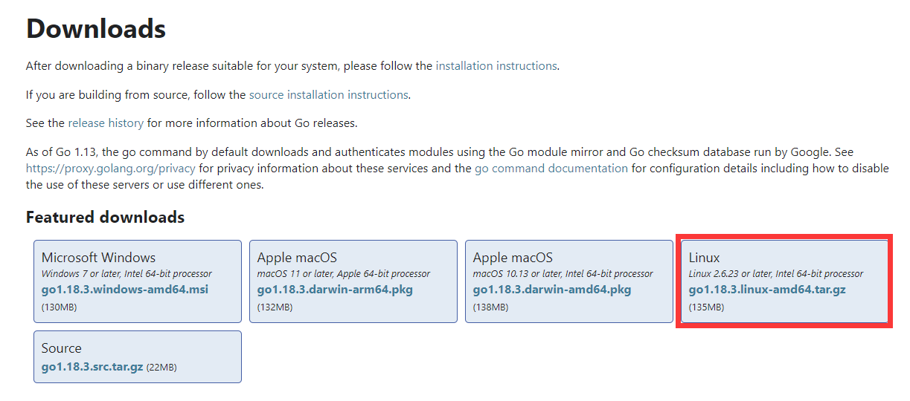

### 2. 解压

```bash
tar -C  /usr/local/ -xzvf go1.18.3.linux-amd64.tar.gz
```

### 3. 查看版本

```bash
cd /usr/local/go
bin/go version
# go version go1.18.3 linux/arm64
```

### 4. 配置环境变量

```bash
vim /etc/profile
# 增加下面几行代码
export GOROOT=/usr/local/go
export GOPATH=/usr/local/gopath
export PATH=$PATH:$GOROOT/bin
```

### 5. 使配置生效

```bash
source /etc/profile
```

### 6. Hello, World!

```bash
vim hello_world.go
```

```go
package main

import "fmt"

func main() {
	fmt.Println("Hello, World!")
}
```

```bash
go run hello_world.go
# Hello, World!
```

## 在windows 11系统中配置Go语言环境

> IDE选择Visual Studio Code

### 1. 在[https://golang.org/dl/](https://golang.org/dl/)下载安装包

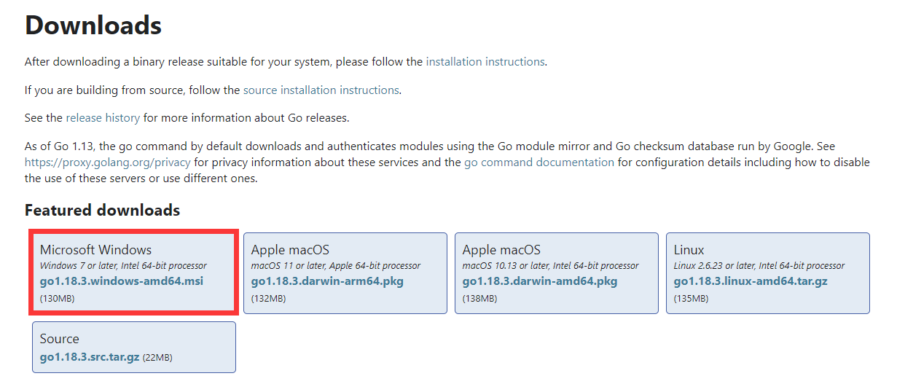

### 2. 一路默认安装即可

### 3. 配置环境变量

#### 配置GOPROXY

Go1.12版本之后，开始使用go mod模式来管理依赖环境了

由于国内访问不到默认的GOPROXY配置链接，所以我们需要换一个PROXY，这里推荐使用[https://goproxy.io](https://goproxy.io)或[https://goproxy.cn](https://goproxy.cn)。

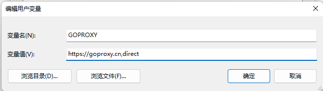

#### GO MOD设置

要启用go module支持首先要设置环境变量GO111MODULE，通过它可以开启或关闭模块支持，它有三个可选值：off、on、auto，默认值是auto。

1. GO111MODULE=off禁用模块支持，编译时会从GOPATH和vendor文件夹中查找包。
2. GO111MODULE=on启用模块支持，编译时会忽略GOPATH和vendor文件夹，只根据 go.mod下载依赖。
3. GO111MODULE=auto，当项目在$GOPATH/src外且项目根目录有go.mod文件时，开启模块支持。

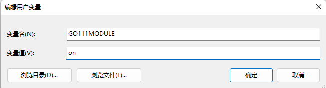

### 4.在VScode中新建一个项目：

使用go module模式新建项目时，我们需要通过go mod init 项目名命令对项目进行初始化，该命令会在项目根目录下生成go.mod文件。例如，我们使用go-sample作为我们第一个Go项目的名称，执行如下命令。

```bash
go mod init go-sample
```

### 5. 安装插件

创建工作目录 C:\>Go_WorkSpace。在Go_WorkSpace文件中新建一个hello.go文件，VScode会自动跳出需要安装的工具，【install All】即可

### 6.Hello World!

文件名: hello.go，代码如下：

```bash
package main

import "fmt"

func main() {
   fmt.Println("Hello, World!")
}
```

使用 go 命令执行以上代码输出结果如下：

```bash
C:\Go_WorkSpace>go run hello.go

Hello, World!
```

---

# Go语言结构

## Go Hello World 实例

Go 语言的基础组成有以下几个部分：

- 包声明
- 引入包
- 函数
- 变量
- 语句 & 表达式
- 注释

接下来让我们来看下简单的代码，该代码输出了"Hello World!":

```bash
package main

import "fmt"

func main() {
   /* 这是我的第一个简单的程序 */
   fmt.Println("Hello, World!")
}
```

让我们来看下以上程序的各个部分：

1. 第一行代码 *package main* 定义了包名。你必须在源文件中非注释的第一行指明这个文件属于哪个包，如：package main。package main表示一个可独立执行的程序，每个 Go 应用程序都包含一个名为 main 的包。
2. 下一行 *import "fmt"* 告诉 Go 编译器这个程序需要使用 fmt 包（的函数，或其他元素），fmt 包实现了格式化 IO（输入/输出）的函数。
3. 下一行 *func main()* 是程序开始执行的函数。main 函数是每一个可执行程序所必须包含的，一般来说都是在启动后第一个执行的函数（如果有 init() 函数则会先执行该函数）。
4. 下一行 /*...*/ 是注释，在程序执行时将被忽略。单行注释是最常见的注释形式，你可以在任何地方使用以 // 开头的单行注释。多行注释也叫块注释，均已以 /* 开头，并以 */ 结尾，且不可以嵌套使用，多行注释一般用于包的文档描述或注释成块的代码片段。
5. 下一行 *fmt.Println(...)* 可以将字符串输出到控制台，并在最后自动增加换行字符 \n。
   使用 fmt.Print("hello, world\n") 可以得到相同的结果。
   Print 和 Println 这两个函数也支持使用变量，如：fmt.Println(arr)。如果没有特别指定，它们会以默认的打印格式将变量 arr 输出到控制台。
6. 当标识符（包括常量、变量、类型、函数名、结构字段等等）以一个大写字母开头，如：Group1，那么使用这种形式的标识符的对象就可以被外部包的代码所使用（客户端程序需要先导入这个包），这被称为导出（像面向对象语言中的 public）；标识符如果以小写字母开头，则对包外是不可见的，但是他们在整个包的内部是可见并且可用的（像面向对象语言中的 private ）。

---

# 基础语法

## Go标记

Go 程序可以由多个标记组成，可以是关键字，标识符，常量，字符串，符号。如以下 GO 语句由 6 个标记组成：

```go
fmt.Println("Hello, World!")
```

6 个标记是(每行一个)：

```go
1. fmt
2. .
3. Println
4. (
5. "Hello, World!"
6. )
```

------

## 行分隔符

在 Go 程序中，一行代表一个语句结束。每个语句不需要像 C 家族中的其它语言一样以分号 ; 结尾，因为这些工作都将由 Go 编译器自动完成。

如果你打算将多个语句写在同一行，它们则必须使用 ; 人为区分，但在实际开发中我们并不鼓励这种做法。

以下为两个语句：

```go
fmt.Println("Hello, World!")
fmt.Println("W3Cschool教程：w3cschool.cn")
```

------

## 注释

注释不会被编译，每一个包应该有相关注释。

单行注释是最常见的注释形式，你可以在任何地方使用以 // 开头的单行注释。多行注释也叫块注释，均已以 /* 开头，并以 */ 结尾。如：

```go
// 单行注释
/*
 Author by w3cschoolW3Cschool教程
 我是多行注释
 */
```

------

## 标识符

标识符用来命名变量、类型等程序实体。一个标识符实际上就是一个或是多个字母(A ~ Z 和 a ~ z) 数字(0 ~ 9)、下划线_组成的序列，但是**第一个字符不能是数字**，只能是字母或下划线。

以下是有效的标识符：

```go
mahesh   kumar   abc   move_name   a_123
myname50   _temp   j   a23b9   retVal
```

以下是无效的标识符：

- 1ab（以数字开头）
- case（Go 语言的关键字）
- a+b（运算符是不允许的）

------

## 字符串连接

Go 语言的字符串可以通过 + 实现连接：

## 实例

```go
package main
import "fmt"
func main(){
    fmt.Println("W3Cschool"+"是学习编程的好地方")
}
```

以上实例输出结果为：

```go
W3Cschool是学习编程的好地方
```

------

## 关键字

下面列举了 Go 代码中会使用到的 25 个关键字或保留字：

| break    | default     | func   | interface | select |
| -------- | ----------- | ------ | --------- | ------ |
| case     | defer       | go     | map       | struct |
| chan     | else        | goto   | package   | switch |
| const    | fallthrough | if     | range     | type   |
| continue | for         | import | return    | var    |

除了以上介绍的这些关键字，Go 语言还有 36 个预定义标识符：

| append | bool    | byte    | cap     | close  | complex | complex64 | complex128 | uint16  |
| ------ | ------- | ------- | ------- | ------ | ------- | --------- | ---------- | ------- |
| copy   | false   | float32 | float64 | imag   | int     | int8      | int16      | uint32  |
| int32  | int64   | iota    | len     | make   | new     | nil       | panic      | uint64  |
| print  | println | real    | recover | string | true    | uint      | uint8      | uintptr |

程序一般由**关键字、常量、变量、运算符、类型和函数**组成。

程序中可能会使用到这些分隔符：括号 ()，中括号 [] 和大括号 {}。

程序中可能会使用到这些标点符号：.、,、;、: 和 …。

------

## Go 语言的空格

Go 语言中变量的声明必须使用空格隔开，如：

```go
var age int
```

语句中**适当使用空格**能让程序看易阅读。

无空格：

```go
fruit=apples+oranges
```

在变量与运算符间加入空格，程序看起来更加美观，如：

```go
fruit = apples + oranges
```

---

# 数据类型

在 Go 编程语言中，数据类型用于声明函数和变量。

数据类型的出现是为了把数据分成所需内存大小不同的数据，编程的时候需要用大数据的时候才需要申请大内存，就可以充分利用内存。

Go 语言按类别有以下几种数据类型：

| 类型           | 描述                                                         |
| :------------- | ------------------------------------------------------------ |
| **布尔型**     | 布尔型的值只可以是常量 true 或者 false。一个简单的例子：var b bool = true。 |
| **数字类型**   | 整型 int 和浮点型 float，Go 语言支持整型和浮点型数字，并且原生支持复数，其中位的运算采用补码。 |
| **字符串类型** | 字符串就是一串固定长度的字符连接起来的字符序列。Go的字符串是由单个字节连接起来的。Go语言的字符串的字节使用UTF-8编码标识Unicode文本。 |
| **派生类型**   | 包括：(a) 指针类型（Pointer）(b) 数组类型(c) 结构体类型(struct)(d) 联合体类型 (union)(e) 函数类型(f) 切片类型(g) 接口类型（interface）(h) Map 类型(i) Channel 类型 |

------

## 数字类型

整型：

| 序号 | 类型和描述                                                   |
| :--- | :----------------------------------------------------------- |
| 1    | **uint8** 无符号 8 位整型 (0 到 255)                         |
| 2    | **uint16** 无符号 16 位整型 (0 到 65535)                     |
| 3    | **uint32** 无符号 32 位整型 (0 到 4294967295)                |
| 4    | **uint64** 无符号 64 位整型 (0 到 18446744073709551615)      |
| 5    | **int8** 有符号 8 位整型 (-128 到 127)                       |
| 6    | **int16** 有符号 16 位整型 (-32768 到 32767)                 |
| 7    | **int32** 有符号 32 位整型 (-2147483648 到 2147483647)       |
| 8    | **int64** 有符号 64 位整型 (-9223372036854775808 到 9223372036854775807) |

浮点型：

| 序号 | 类型和描述                        |
| :--- | :-------------------------------- |
| 1    | **float32** IEEE-754 32位浮点型数 |
| 2    | **float64** IEEE-754 64位浮点型数 |
| 3    | **complex64** 32 位实数和虚数     |
| 4    | **complex128** 64 位实数和虚数    |

------

## 其他数字类型

以下列出了其他更多的数字类型：

| 序号 | 类型和描述                               |
| :--- | :--------------------------------------- |
| 1    | **byte** 类似 uint8                      |
| 2    | **rune** 类似 int32                      |
| 3    | **uint** 32 或 64 位                     |
| 4    | **int** 与 uint 一样大小                 |
| 5    | **uintptr** 无符号整型，用于存放一个指针 |

---

# 变量

变量来源于数学，是计算机语言中能储存计算结果或能表示值的抽象概念。变量可以通过变量名访问。

Go 语言变量名由字母、数字、下划线组成，其中首个字母不能为数字。

声明变量的一般形式是使用 var 关键字：

```go
var identifier type
```

### 变量声明

第一种，指定变量类型，声明后若不赋值，使用默认值。

```go
var v_name v_type
v_name = value
```

第二种，根据值自行判定变量类型。

```go
var v_name = value
```

第三种，省略var, 注意 :=左侧的变量不应该是已经声明过的，否则会导致编译错误。

```go
v_name := value

// 例如
var a int = 10
var b = 10
c := 10
```

实例如下：

```go
package main
var a = "hello"
var b string = "world"
var c bool

func main(){
    println(a, b, c)
}
```

以上实例执行结果为：

```go
hello world false
```

### 多变量声明

```go
// 类型相同多个变量, 非全局变量
var vname1, vname2, vname3 type
vname1, vname2, vname3 = v1, v2, v3

 
// 和 python 很像,不需要显示声明类型，自动推断
var vname1, vname2, vname3 = v1, v2, v3
 
 
// 出现在 := 左侧的变量不应该是已经被声明过的，否则会导致编译错误
vname1, vname2, vname3 := v1, v2, v3
 
// 这种因式分解关键字的写法一般用于声明全局变量
var (
    vname1 v_type1
    vname2 v_type2
)
```

实例如下：

```go
package main

var x, y int
var (  
    a int
    b bool
)

var c, d int = 1, 2
var e, f = 123, "hello"

//这种不带声明格式的只能在函数体中出现
//g, h := 123, "hello"

func main(){
    g, h := 123, "hello"
    println(x, y, a, b, c, d, e, f, g, h)
}
```

以上实例执行结果为：

```go
0 0 0 false 1 2 123 hello 123 hello
```

------

## 值类型和引用类型

所有像 int、float、bool 和 string 这些基本类型都属于值类型，使用这些类型的变量直接指向存在内存中的值：

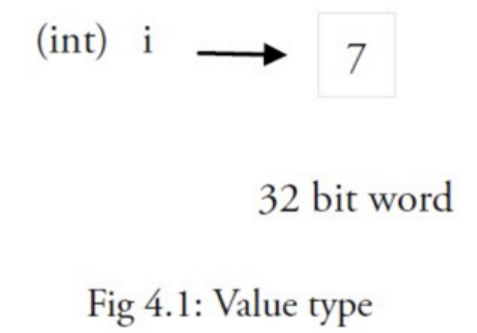

当使用等号 `=` 将一个变量的值赋值给另一个变量时，如：`j = i`，实际上是在内存中将 i 的值进行了拷贝：

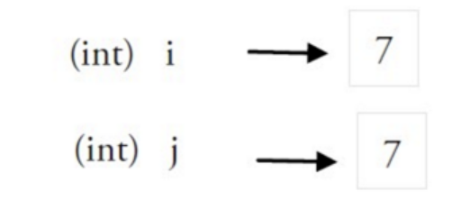

你可以通过 &i 来获取变量 i 的内存地址，例如：0xf840000040（每次的地址都可能不一样）。值类型的变量的值存储在栈中。

内存地址会根据机器的不同而有所不同，甚至相同的程序在不同的机器上执行后也会有不同的内存地址。因为每台机器可能有不同的存储器布局，并且位置分配也可能不同。

更复杂的数据通常会需要使用多个值，这些数据一般使用引用类型保存。

一个引用类型的变量 r1 存储的是 r1 的值所在的内存地址（数字），或内存地址中第一个值所在的位置。

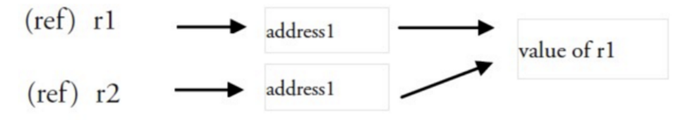

这个内存地址为称之为指针，这个指针实际上也被存在另外的某一个值中。

同一个引用类型的指针指向的多个值可以是在连续的内存地址中（内存布局是连续的），这也是计算效率最高的一种存储形式；也可以将这些值分散存放在内存中，每个值都指示了下一个值所在的内存地址。

当使用赋值语句 r2 = r1 时，只有引用（地址）被复制。

如果 r1 的值被改变了，那么这个值的所有引用都会指向被修改后的内容，在这个例子中，r2 也会受到影响。

------

## 简短形式，使用 := 赋值操作符

我们知道可以在变量的初始化时省略变量的类型而由系统自动推断，声明语句写上 var 关键字其实是显得有些多余了，因此我们可以将它们简写为 a := 50 或 b := false。

a 和 b 的类型（int 和 bool）将由编译器自动推断。

这是使用变量的首选形式，但是它只能被用在函数体内，而不可以用于全局变量的声明与赋值。使用操作符 := 可以高效地创建一个新的变量，称之为初始化声明。

### 注意事项

如果在相同的代码块中，我们不可以再次对于相同名称的变量使用初始化声明，例如：a := 20 就是不被允许的（因为在前文中已经声明了a:=50），编译器会提示错误 no new variables on left side of :=，但是 a = 20 是可以的，因为这是给相同的变量赋予一个新的值。

如果你在定义变量 a 之前使用它，则会得到编译错误 undefined: a。

如果你声明了一个局部变量却没有在相同的代码块中使用它，同样会得到编译错误，例如下面这个例子当中的变量 a：

```go
func main() {
   var a string = "abc"
   fmt.Println("hello, world")
}
```

尝试编译这段代码将得到错误 **a declared but not used**。

此外，单纯地给 a 赋值也是不够的，这个值必须被使用，所以使用

```go
fmt.Println("hello, world", a)
```

会移除错误。

但是全局变量是允许声明但不使用。

同一类型的多个变量可以声明在同一行，如：

```go
var a, b, c int
```

多变量可以在同一行进行赋值，如：

```go
a, b, c = 5, 7, "abc"
```

上面这行假设了变量 a，b 和 c 都已经被声明，否则的话应该这样使用：

```go
a, b, c := 5, 7, "abc"
```

右边的这些值以相同的顺序赋值给左边的变量，所以 a 的值是 5， b 的值是 7，c 的值是 "abc"。

这被称为 并行 或 同时 赋值。

如果你想要交换两个变量的值，则可以简单地使用 a, b = b, a。

空白标识符 _ 也被用于抛弃值，如值 5 在：_, b = 5, 7 中被抛弃。

_ 实际上是一个只写变量，你不能得到它的值。这样做是因为 Go 语言中你必须使用所有被声明的变量，但有时你并不需要使用从一个函数得到的所有返回值。

并行赋值也被用于当一个函数返回多个返回值时，比如这里的 val 和错误 err 是通过调用 Func1 函数同时得到：val, err = Func1(var1)。

---

# 常量

常量是一个简单值的标识符，**在程序运行时，不会被修改的量**。

常量中的数据类型只可以是布尔型、数字型（整数型、浮点型和复数）和字符串型。

常量的定义格式：

```go
const identifier [type] = value
```

你可以省略类型说明符 [type]，因为编译器可以根据变量的值来推断其类型。

- 显式类型定义： `const b string = "abc"`
- 隐式类型定义： `const b = "abc"`

多个相同类型的声明可以简写为：

```go
const c_name1, c_name2 = value1, value2
```

以下实例演示了常量的应用：

```go
package main

import "fmt"

func main() {
   const LENGTH int = 10
   const WIDTH int = 5   
   var area int
   const a, b, c = 1, false, "str" //多重赋值

   area = LENGTH * WIDTH
   fmt.Printf("面积为 : %d", area)
   println()
   println(a, b, c)   
}
```

以上实例运行结果为：

```go
面积为 : 50
1 false str
```

常量还可以用作枚举：

```go
const (
    Unknown = 0
    Female = 1
    Male = 2
)
```

数字 0、1 和 2 分别代表未知性别、女性和男性。

常量可以用len(), cap(), unsafe.Sizeof()常量计算表达式的值。常量表达式中，函数必须是内置函数，否则编译不通过：

```go
package main

import "unsafe"
const (
    a = "abc"
    b = len(a)
    c = unsafe.Sizeof(a)
)

func main(){
    println(a, b, c)
}
```

以上实例运行结果为：

```go
abc 3 16
```

------

## iota

iota，特殊常量，可以认为是**一个可以被编译器修改的常量**。

在每一个const关键字出现时，被重置为0，然后再下一个const出现之前，每出现一次iota，其所代表的数字会自动增加1。

iota 可以被用作枚举值：

```go
const (
    a = iota
    b = iota
    c = iota
)
```

第一个 iota 等于 0，每当 iota 在新的一行被使用时，它的值都会自动加 1；所以 a=0, b=1, c=2 可以简写为如下形式：

```go
const (
    a = iota
    b
    c
)
```

### iota 用法

```go
package main

import "fmt"

func main() {
    const (
            a = iota   //0
            b          //1
            c          //2
            d = "ha"   //独立值，iota += 1
            e          //"ha"   iota += 1
            f = 100    //iota +=1
            g          //100  iota +=1
            h = iota   //7,恢复计数
            i          //8
    )
    fmt.Println(a,b,c,d,e,f,g,h,i)
}
```

以上实例运行结果为：

```go
0 1 2 ha ha 100 100 7 8
```

再看个有趣的的 iota 实例：

```go
package main

import "fmt"
const (
    i=1<<iota
    j=3<<iota
    k
    l
)
func main() {
    fmt.Println("i=",i)
    fmt.Println("j=",j)
    fmt.Println("k=",k)
    fmt.Println("l=",l)
} 
```

以上实例运行结果为：

```go
i= 1
j= 6
k= 12
l= 24
```

iota表示从0开始自动加1，所以i=1<<0,j=3<<1（<<表示左移的意思），即：i=1,j=6，这没问题，关键在k和l，从输出结果看，k=3<<2，l=3<<3。

简单表述:

- i=1：左移 0 位，不变仍为 1。
- j=3：左移 1 位，变为二进制 110，即 6。
- k=3：左移 2 位，变为二进制 1100，即 12。
- l=3：左移 3 位，变为二进制 11000，即 24。

注：<<n == *(2^n)。

---

# 运算符

运算符用于在程序运行时执行数学或逻辑运算。

Go 语言内置的运算符有：

- 算术运算符
- 关系运算符
- 逻辑运算符
- 位运算符
- 赋值运算符
- 其他运算符

接下来让我们来详细看看各个运算符的介绍。

------

## 算术运算符

下表列出了所有Go语言的算术运算符。假定 A 值为 10，B 值为 20。

| 运算符 | 描述 | 实例               |
| :----- | :--- | :----------------- |
| +      | 相加 | A + B 输出结果 30  |
| -      | 相减 | A - B 输出结果 -10 |
| *      | 相乘 | A * B 输出结果 200 |
| /      | 相除 | B / A 输出结果 2   |
| %      | 求余 | B % A 输出结果 0   |
| ++     | 自增 | A++ 输出结果 11    |
| --     | 自减 | A-- 输出结果 9     |

以下实例演示了各个算术运算符的用法：

```go
package main

import "fmt"

func main() {

   var a int = 21
   var b int = 10
   var c int

   c = a + b
   fmt.Printf("第一行 - c 的值为 %d\n", c )
   c = a - b
   fmt.Printf("第二行 - c 的值为 %d\n", c )
   c = a * b
   fmt.Printf("第三行 - c 的值为 %d\n", c )
   c = a / b
   fmt.Printf("第四行 - c 的值为 %d\n", c )
   c = a % b
   fmt.Printf("第五行 - c 的值为 %d\n", c )
   a++
   fmt.Printf("第六行 - c 的值为 %d\n", a )
   a--
   fmt.Printf("第七行 - c 的值为 %d\n", a )
}
```

以上实例运行结果：

```go
第一行 - c 的值为 31
第二行 - c 的值为 11
第三行 - c 的值为 210
第四行 - c 的值为 2
第五行 - c 的值为 1
第六行 - c 的值为 22
第七行 - c 的值为 21
```

------

## 关系运算符

下表列出了所有Go语言的关系运算符。假定 A 值为 10，B 值为 20。

| 运算符 | 描述                                                         | 实例              |
| :----- | :----------------------------------------------------------- | :---------------- |
| ==     | 检查两个值是否相等，如果相等返回 True 否则返回 False。       | (A == B) 为 False |
| !=     | 检查两个值是否不相等，如果不相等返回 True 否则返回 False。   | (A != B) 为 True  |
| >      | 检查左边值是否大于右边值，如果是返回 True 否则返回 False。   | (A > B) 为 False  |
| <      | 检查左边值是否小于右边值，如果是返回 True 否则返回 False。   | (A < B) 为 True   |
| >=     | 检查左边值是否大于等于右边值，如果是返回 True 否则返回 False。 | (A >= B) 为 False |
| <=     | 检查左边值是否小于等于右边值，如果是返回 True 否则返回 False。 | (A <= B) 为 True  |

以下实例演示了关系运算符的用法：

```go
package main

import "fmt"

func main() {
   var a int = 21
   var b int = 10

   if a == b  {
      fmt.Printf("第一行 - a 等于 b\n" )
   } else {
      fmt.Printf("第一行 - a 不等于 b\n" )
   }
   if  a < b  {
      fmt.Printf("第二行 - a 小于 b\n" )
   } else {
      fmt.Printf("第二行 - a 不小于 b\n" )
   }
   if  a > b  {
      fmt.Printf("第三行 - a 大于 b\n" )
   } else {
      fmt.Printf("第三行 - a 不大于 b\n" )
   }
   /* Lets change value of a and b */
   a = 5
   b = 20
   if  a <= b  {
      fmt.Printf("第四行 - a 小于等于  b\n" )
   }
   if  b >= a  {
      fmt.Printf("第五行 - b 大于等于 a\n" )
   }
}
```

以上实例运行结果：

```go
第一行 - a 不等于 b
第二行 - a 不小于 b
第三行 - a 大于 b
第四行 - a 小于等于  b
第五行 - b 大于等于 a
```

------

## 逻辑运算符

下表列出了所有Go语言的逻辑运算符。假定 A 值为 True，B 值为 False。

| 运算符 | 描述                                                         | 实例               |
| :----- | :----------------------------------------------------------- | :----------------- |
| &&     | 逻辑 AND 运算符。 如果两边的操作数都是 True，则条件 True，否则为 False。 | (A && B) 为 False  |
| \|\|   | 逻辑 OR 运算符。 如果两边的操作数有一个 True，则条件 True，否则为 False。 | (A \|\| B) 为 True |
| !      | 逻辑 NOT 运算符。 如果条件为 True，则逻辑 NOT 条件 False，否则为 True。 | !(A && B) 为 True  |

>  在其他语言中（比如C语言，java语言，JavaScript语言等），条件语句会使用一个小括号将其包围起来，在go语言中不需要使用这样的小括号（类似于python），但是如果使用这样的小括号也可以正常通过运行（但这是不符合go语言风格的，某些IDE会提示冗余括号）。为了整体代码风格更偏向于go语言，本手册代码不采用小括号包围条件语句。

以下实例演示了逻辑运算符的用法：

```go
package main

import "fmt"

func main() {
   var a bool = true
   var b bool = false
   if  a && b  {
      fmt.Printf("第一行 - 条件为 true\n" )
   }
   if  a || b  {
      fmt.Printf("第二行 - 条件为 true\n" )
   }
   /* 修改 a 和 b 的值 */
   a = false
   b = true
   if  a && b  {
      fmt.Printf("第三行 - 条件为 true\n" )
   } else {
      fmt.Printf("第三行 - 条件为 false\n" )
   }
   if  !(a && b)  {
      fmt.Printf("第四行 - 条件为 true\n" )
   }
}
```

以上实例运行结果：

```go
第二行 - 条件为 true
第三行 - 条件为 false
第四行 - 条件为 true
```

------

## 位运算符

位运算符可以对整数在内存中的二进制位进行操作。

下表列出了位运算符 &, |, 和 ^ 的计算：

>  &：与运算，全真为真； |：或运算，全假才假； ^:异或运算，相同为假，不同为真

| p    | q    | p & q | p \| q | p ^ q |
| :--- | :--- | :---- | :----- | :---- |
| 0    | 0    | 0     | 0      | 0     |
| 0    | 1    | 0     | 1      | 1     |
| 1    | 1    | 1     | 1      | 0     |
| 1    | 0    | 0     | 1      | 1     |

假定 A = 60; B = 13; 其二进制数转换为：

```go
A = 0011 1100

B = 0000 1101

-----------------

A&B = 0000 1100

A|B = 0011 1101

A^B = 0011 0001

~A  = 1100 0011
```


Go 语言支持的位运算符如下表所示。假定 A 为60，B 为13：

| 运算符 | 描述                                                         | 实例                                   |
| :----- | :----------------------------------------------------------- | :------------------------------------- |
| &      | 按位与运算符"&"是双目运算符。 其功能是参与运算的两数各对应的二进位相与。 | (A & B) 结果为 12, 二进制为 0000 1100  |
| \|     | 按位或运算符"\|"是双目运算符。 其功能是参与运算的两数各对应的二进位相或 | (A \| B) 结果为 61, 二进制为 0011 1101 |
| ^      | 按位异或运算符"^"是双目运算符。 其功能是参与运算的两数各对应的二进位相异或，当两对应的二进位相异时，结果为1。 | (A ^ B) 结果为 49, 二进制为 0011 0001  |
| <<     | 左移运算符"<<"是双目运算符。左移n位就是乘以2的n次方。 其功能把"<<"左边的运算数的各二进位全部左移若干位，由"<<"右边的数指定移动的位数，高位丢弃，低位补0。 | A << 2 结果为 240 ，二进制为 1111 0000 |
| >>     | 右移运算符">>"是双目运算符。右移n位就是除以2的n次方。 其功能是把">>"左边的运算数的各二进位全部右移若干位，">>"右边的数指定移动的位数。 | A >> 2 结果为 15 ，二进制为 0000 1111  |

以下实例演示了逻辑运算符的用法：

```go
package main

import "fmt"

func main() {

   var a uint = 60  /* 60 = 0011 1100 */  
   var b uint = 13  /* 13 = 0000 1101 */
   var c uint = 0          

   c = a & b       /* 12 = 0000 1100 */ 
   fmt.Printf("第一行 - c 的值为 %d\n", c )

   c = a | b       /* 61 = 0011 1101 */
   fmt.Printf("第二行 - c 的值为 %d\n", c )

   c = a ^ b       /* 49 = 0011 0001 */
   fmt.Printf("第三行 - c 的值为 %d\n", c )

   c = a << 2     /* 240 = 1111 0000 */
   fmt.Printf("第四行 - c 的值为 %d\n", c )
   c = a >> 2     /* 15 = 0000 1111 */
   fmt.Printf("第五行 - c 的值为 %d\n", c )
}
```

以上实例运行结果：

```go
第一行 - c 的值为 12
第二行 - c 的值为 61
第三行 - c 的值为 49
第四行 - c 的值为 240
第五行 - c 的值为 15
```

------

## 赋值运算符

下表列出了所有Go语言的赋值运算符。

| 运算符 | 描述                                           | 实例                                  |
| :----- | :--------------------------------------------- | :------------------------------------ |
| =      | 简单的赋值运算符，将一个表达式的值赋给一个左值 | C = A + B 将 A + B 表达式结果赋值给 C |
| +=     | 相加后再赋值                                   | C += A 等于 C = C + A                 |
| -=     | 相减后再赋值                                   | C -= A 等于 C = C - A                 |
| *=     | 相乘后再赋值                                   | C *= A 等于 C = C * A                 |
| /=     | 相除后再赋值                                   | C /= A 等于 C = C / A                 |
| %=     | 求余后再赋值                                   | C %= A 等于 C = C % A                 |
| <<=    | 左移后赋值                                     | C <<= 2 等于 C = C << 2               |
| >>=    | 右移后赋值                                     | C >>= 2 等于 C = C >> 2               |
| &=     | 按位与后赋值                                   | C &= 2 等于 C = C & 2                 |
| ^=     | 按位异或后赋值                                 | C ^= 2 等于 C = C ^ 2                 |
| \|=    | 按位或后赋值                                   | C \|= 2 等于 C = C \| 2               |

以下实例演示了赋值运算符的用法：

```go
package main

import "fmt"

func main() {
   var a int = 21
   var c int

   c =  a
   fmt.Printf("第 1 行 - =  运算符实例，c 值为 = %d\n", c )

   c +=  a
   fmt.Printf("第 2 行 - += 运算符实例，c 值为 = %d\n", c )

   c -=  a
   fmt.Printf("第 3 行 - -= 运算符实例，c 值为 = %d\n", c )

   c *=  a
   fmt.Printf("第 4 行 - *= 运算符实例，c 值为 = %d\n", c )

   c /=  a
   fmt.Printf("第 5 行 - /= 运算符实例，c 值为 = %d\n", c )

   c  = 200
   c <<=  2
   fmt.Printf("第 6 行  - <<= 运算符实例，c 值为 = %d\n", c )

   c >>=  2
   fmt.Printf("第 7 行 - >>= 运算符实例，c 值为 = %d\n", c )

   c &=  2
   fmt.Printf("第 8 行 - &= 运算符实例，c 值为 = %d\n", c )

   c ^=  2
   fmt.Printf("第 9 行 - ^= 运算符实例，c 值为 = %d\n", c )

   c |=  2
   fmt.Printf("第 10 行 - |= 运算符实例，c 值为 = %d\n", c )
}
```

以上实例运行结果：

```go
第 1 行 - =  运算符实例，c 值为 = 21
第 2 行 - += 运算符实例，c 值为 = 42
第 3 行 - -= 运算符实例，c 值为 = 21
第 4 行 - *= 运算符实例，c 值为 = 441
第 5 行 - /= 运算符实例，c 值为 = 21
第 6 行  - <<= 运算符实例，c 值为 = 800
第 7 行 - >>= 运算符实例，c 值为 = 200
第 8 行 - &= 运算符实例，c 值为 = 0
第 9 行 - ^= 运算符实例，c 值为 = 2
第 10 行 - |= 运算符实例，c 值为 = 2
```

------

## 其他运算符

下表列出了Go语言的其他运算符。

| 运算符 | 描述             | 实例                       |
| :----- | :--------------- | :------------------------- |
| &      | 返回变量存储地址 | &a; 将给出变量的实际地址。 |
| *      | 指针变量。       | *a; 是一个指针变量         |

以下实例演示了其他运算符的用法：

```go
package main

import "fmt"

func main() {
   var a int = 4
   var b int32
   var c float32
   var ptr *int

   /* 运算符实例 */
   fmt.Printf("第 1 行 - a 变量类型为 = %T\n", a )
   fmt.Printf("第 2 行 - b 变量类型为 = %T\n", b )
   fmt.Printf("第 3 行 - c 变量类型为 = %T\n", c )

   /*  & 和 * 运算符实例 */
   ptr = &a    /* 'ptr' 包含了 'a' 变量的地址 */
   fmt.Printf("a 的值为  %d\n", a)
   fmt.Printf("*ptr 为 %d\n", *ptr)
}
```

以上实例运行结果：

```go
第 1 行 - a 变量类型为 = int
第 2 行 - b 变量类型为 = int32
第 3 行 - c 变量类型为 = float32
a 的值为  4
*ptr 为 4
```

------

## 运算符优先级

有些运算符拥有较高的优先级，二元运算符的运算方向均是从左至右。下表列出了所有运算符以及它们的优先级，由上至下代表优先级由高到低：

| 优先级 | 运算符        |
| :----- | :------------ |
| 7      | ^ !           |
| 6      | * / % <> & &^ |
| 5      | + - \| ^      |
| 4      | == != < = >   |
| 3      | <-            |
| 2      | &&            |
| 1      | \|\|          |

当然，你可以通过使用括号来临时提升某个表达式的整体运算优先级。

以上实例运行结果：

```go
package main

import "fmt"

func main() {
   var a int = 20
   var b int = 10
   var c int = 15
   var d int = 5
   var e int;

   e = (a + b) * c / d;      // ( 30 * 15 ) / 5
   fmt.Printf("(a + b) * c / d 的值为 : %d\n",  e )

   e = ((a + b) * c) / d;    // (30 * 15 ) / 5
   fmt.Printf("((a + b) * c) / d 的值为  : %d\n" ,  e )

   e = (a + b) * (c / d);   // (30) * (15/5)
   fmt.Printf("(a + b) * (c / d) 的值为  : %d\n",  e )

   e = a + (b * c) / d;     //  20 + (150/5)
   fmt.Printf("a + (b * c) / d 的值为  : %d\n" ,  e ) 
}
```

以上实例运行结果：

```go
(a + b) * c / d 的值为 : 90
((a + b) * c) / d 的值为  : 90
(a + b) * (c / d) 的值为  : 90
a + (b * c) / d 的值为  : 50
```

---

# 条件语句

条件语句需要开发者通过指定一个或多个条件，并通过测试条件是否为 true 来决定是否执行指定语句，并在条件为 false 的情况再执行另外的语句。

Go 语言提供了以下几种条件判断语句：

| 语句           | 描述                                                         |
| :------------- | :----------------------------------------------------------- |
| if 语句        | **if 语句** 由一个布尔表达式后紧跟一个或多个语句组成。       |
| if...else 语句 | **if 语句** 后可以使用可选的 **else 语句**, else 语句中的表达式在布尔表达式为 false 时执行。 |
| if 嵌套语句    | 你可以在 **if** 或 **else if** 语句中嵌入一个或多个 **if** 或 **else if** 语句。 |
| switch 语句    | **switch** 语句用于基于不同条件执行不同动作。                |
| select 语句    | **select** 语句类似于 **switch** 语句，但是select会随机执行一个可运行的case。如果没有case可运行，它将阻塞，直到有case可运行。 |

## if 语句

if 语句由布尔表达式后紧跟一个或多个语句组成。

### 语法

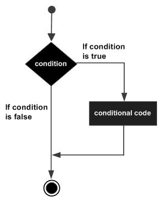

Go 编程语言中 if 语句的语法如下：

```go
if 布尔表达式 {
   /* 在布尔表达式为 true 时执行 */
}
```

If 在布尔表达式为 true 时，其后紧跟的语句块执行，如果为 false 则不执行。

### 实例

```go
package main

import "fmt"

func main() {
   /* 定义局部变量 */
   var a int = 10
 
   /* 使用 if 语句判断布尔表达式 */
   if a < 20 {
       /* 如果条件为 true 则执行以下语句 */
       fmt.Printf("a 小于 20\n" )
   }
   fmt.Printf("a 的值为 : %d\n", a)
}
```

以上代码执行结果为：

```go
a 小于 20
a 的值为 : 10
```

## if...else 语句

if 语句 后可以使用可选的 else 语句, else 语句中的表达式在布尔表达式为 false 时执行。

### 语法

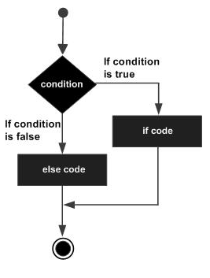

Go 编程语言中 if...else 语句的语法如下：

```go
if 布尔表达式 {
   /* 在布尔表达式为 true 时执行 */
} else {
  /* 在布尔表达式为 false 时执行 */
}
```

If 在布尔表达式为 true 时，其后紧跟的语句块执行，如果为 false 则执行 else 语句块。

## if 嵌套语句

你可以在 if 或 else if 语句中嵌入一个或多个 if 或 else if 语句。

### 语法

Go 编程语言中 if...else 语句的语法如下：

```go
if 布尔表达式 1 {
   /* 在布尔表达式 1 为 true 时执行 */
   if 布尔表达式 2 {
      /* 在布尔表达式 2 为 true 时执行 */
   }
}
```

你可以以同样的方式在 if 语句中嵌套 **else if...else** 语句

### 实例

```go
package main

import "fmt"

func main() {
   /* 定义局部变量 */
   var a int = 100
   var b int = 200
 
   /* 判断条件 */
   if a == 100 {
       /* if 条件语句为 true 执行 */
       if b == 200 {
          /* if 条件语句为 true 执行 */
          fmt.Printf("a 的值为 100 ， b 的值为 200\n" )
       }
   }
   fmt.Printf("a 值为 : %d\n", a )
   fmt.Printf("b 值为 : %d\n", b )
}
```

以上代码执行结果为：

```go
a 的值为 100 ， b 的值为 200
a 值为 : 100
b 值为 : 200
```


## switch语句

switch 语句用于基于不同条件执行不同动作，每一个 case 分支都是唯一的，从上直下逐一测试，直到匹配为止。

switch 语句执行的过程从上至下，直到找到匹配项，匹配项后面也不需要再加break

### 语法

Go 编程语言中 switch 语句的语法如下：

```go
switch var1 {
    case val1:
        ...
    case val2:
        ...
    default:
        ...
}
```

变量 var1 可以是任何类型，而 val1 和 val2 则可以是同类型的任意值。类型不被局限于常量或整数，但必须是相同的类型；或者最终结果为相同类型的表达式。

您可以同时测试多个可能符合条件的值，使用逗号分割它们，例如：case val1, val2, val3。

流程图：

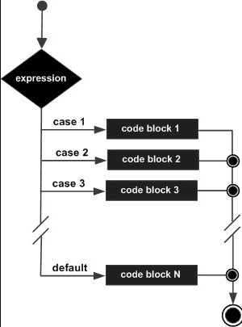

### 实例

```go
package main

import "fmt"

func main() {
   /* 定义局部变量 */
   var grade string = "B"
   var marks int = 90

   switch marks {
      case 90: grade = "A"
      case 80: grade = "B"
      case 50,60,70 : grade = "C"
      default: grade = "D"  
   }

   switch {
      case grade == "A" :
         fmt.Printf("优秀!\n" )     
      case grade == "B", grade == "C" :
         fmt.Printf("良好\n" )      
      case grade == "D" :
         fmt.Printf("及格\n" )      
      case grade == "F":
         fmt.Printf("不及格\n" )
      default:
         fmt.Printf("差\n" )
   }
   fmt.Printf("你的等级是 %s\n", grade )     
}
```

以上代码执行结果为：

```go
优秀!
你的等级是 A
```

------

### Type Switch

switch 语句还可以被用于 type-switch 来判断某个 interface 变量中实际存储的变量类型。

Type Switch 语法格式如下：

```go
switch x.(type){
    case type:
       statement(s)     
    case type:
       statement(s)
    /* 你可以定义任意个数的case */
    default: /* 可选 */
       statement(s)
}
```

### 实例

```go
package main

import "fmt"

func main() {
   var x interface{}
     
   switch i := x.(type) {
      case nil:	  
         fmt.Printf(" x 的类型 :%T",i)                
      case int:	  
         fmt.Printf("x 是 int 型")                       
      case float64:
         fmt.Printf("x 是 float64 型")           
      case func(int) float64:
         fmt.Printf("x 是 func(int) 型")                      
      case bool, string:
         fmt.Printf("x 是 bool 或 string 型" )       
      default:
         fmt.Printf("未知型")     
   }   
}
```

以上代码执行结果为：

```go
x 的类型 :<nil>
```


## select语句

select是Go中的一个控制结构，类似于用于通信的switch语句。每个case必须是一个通信操作，要么是发送要么是接收。

select随机执行一个可运行的case。如果没有case可运行，它将阻塞，直到有case可运行。一个默认的子句应该总是可运行的。

>  这里的通信，可以简单的理解为IO（输入输出），例如如下代码
>
> ```go
> select {
>     case ch1:
>         // 如果从 ch1 信道成功接收数据，则执行该分支代码
>     case ch2 :
>         // 如果成功向 ch2 信道成功发送数据，则执行该分支代码
>     default:
>         // 如果上面都没有成功，则进入 default 分支处理流程
> }
> ```
>
> 更多关于信道（channel）的内容，可以前往
>
> channel详解
>
> 进行了解。

### 语法

Go 编程语言中 select 语句的语法如下：

```go
select {
    case communication clause  :
       statement(s)      
    case communication clause  :
       statement(s)
    /* 你可以定义任意数量的 case */
    default : /* 可选 */
       statement(s)
}
```

**以下描述了 select 语句的语法：**

- 每个case都必须是一个通信

- 所有channel表达式都会被求值

- 所有被发送的表达式都会被求值

- 如果任意某个通信可以进行，它就执行；其他被忽略。

- 如果有多个case都可以运行，Select会随机公平地选出一个执行。其他不会执行。
  否则：

- 1. 如果有default子句，则执行该语句。
  2. 如果没有default字句，select将阻塞，直到某个通信可以运行；Go不会重新对channel或值进行求值。

**select的知识点小结如下：**

1. select语句只能用于信道的读写操作
2. select中的case条件(非阻塞)是并发执行的，select会选择先操作成功的那个case条件去执行，如果多个同时返回，则随机选择一个执行，此时将无法保证执行顺序。对于阻塞的case语句会直到其中有信道可以操作，如果有多个信道可操作，会随机选择其中一个 case 执行
3. 对于case条件语句中，如果存在信道值为nil的读写操作，则该分支将被忽略，可以理解为从select语句中删除了这个case语句
4. 如果有超时条件语句，判断逻辑为如果在这个时间段内一直没有满足条件的case,则执行这个超时case。如果此段时间内出现了可操作的case,则直接执行这个case。一般用超时语句代替了default语句
5. 对于空的select{}，会引起死锁
6. 对于for中的select{}, 也有可能会引起cpu占用过高的问题

### 实例

```go
package main

import "fmt"

func main() {
   var c1, c2, c3 chan int
   var i1, i2 int
   select {
      case i1 = <-c1:
         fmt.Printf("received ", i1, " from c1\n")
      case c2 <- i2:
         fmt.Printf("sent ", i2, " to c2\n")
      case i3, ok := (<-c3):  // same as: i3, ok := <-c3
         if ok {
            fmt.Printf("received ", i3, " from c3\n")
         } else {
            fmt.Printf("c3 is closed\n")
         }
      default:
         fmt.Printf("no communication\n")
   }    
}
```

以上代码执行结果为：

```go
no communication
```

---

# 循环语句

在不少实际问题中有许多具有规律性的重复操作，因此在程序中就需要重复执行某些语句。

Go 语言提供了以下几种类型循环处理语句：

| 循环类型 | 描述                                 |
| :------- | :----------------------------------- |
| for 循环 | 重复执行语句块                       |
| 循环嵌套 | 在 for 循环中嵌套一个或多个 for 循环 |

------

## for循环

for循环是一个循环控制结构，可以执行指定次数的循环。

### 语法

Go语言的For循环有3种形式，只有其中的一种使用分号。

和 C 语言的 for 一样：

```go
for init; condition; post { }
```

和 C 的 while 一样：

```go
for condition { }
```

和 C 的 for(;;) 一样：

```go
for { }
```

- init： 一般为赋值表达式，给控制变量赋初值；
- condition： 关系表达式或逻辑表达式，循环控制条件；
- post： 一般为赋值表达式，给控制变量增量或减量。

for语句执行过程如下：

- ①先对表达式1赋初值；
- ②判别赋值表达式 init 是否满足给定条件，若其值为真，满足循环条件，则执行循环体内语句，然后执行 post，进入第二次循环，再判别 condition；否则判断 condition 的值为假，不满足条件，就终止for循环，执行循环体外语句。

for 循环的 range 格式可以对 slice、map、数组、字符串等进行迭代循环。格式如下：

```go
for key, value := range oldMap {
    newMap[key] = value
}
```

for语句语法流程如下图所示：

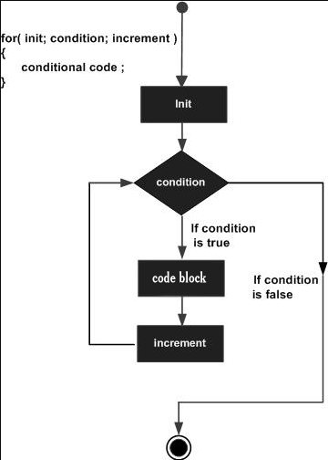

### 实例

```go
package main

import "fmt"

func main() {

   var b int = 15
   var a int

   numbers := [6]int{1, 2, 3, 5} 

   /* for 循环 */
   for a := 0; a < 10; a++ {
      fmt.Printf("a 的值为: %d\n", a)
   }

   for a < b {
      a++
      fmt.Printf("a 的值为: %d\n", a)
      }

   for i,x:= range numbers {
      fmt.Printf("第 %d 位 x 的值 = %d\n", i,x)
   }   
}
```

以上实例运行输出结果为:

```go
a 的值为: 0
a 的值为: 1
a 的值为: 2
a 的值为: 3
a 的值为: 4
a 的值为: 5
a 的值为: 6
a 的值为: 7
a 的值为: 8
a 的值为: 9
a 的值为: 1
a 的值为: 2
a 的值为: 3
a 的值为: 4
a 的值为: 5
a 的值为: 6
a 的值为: 7
a 的值为: 8
a 的值为: 9
a 的值为: 10
a 的值为: 11
a 的值为: 12
a 的值为: 13
a 的值为: 14
a 的值为: 15
第 0 位 x 的值 = 1
第 1 位 x 的值 = 2
第 2 位 x 的值 = 3
第 3 位 x 的值 = 5
第 4 位 x 的值 = 0
第 5 位 x 的值 = 0
```

## 循环嵌套

Go 语言允许用户在循环内使用循环。接下来我们将为大家介绍嵌套循环的使用。

### 语法

以下为 Go 语言嵌套循环的格式：

```go
for [condition |  ( init; condition; increment ) | Range]
{
   for [condition |  ( init; condition; increment ) | Range]
   {
      statement(s)
   }
   statement(s)
}
```

### 实例

以下实例使用循环嵌套来输出 2 到 100 间的素数：

```go
package main

import "fmt"

func main() {
   /* 定义局部变量 */
   var i, j int

   for i=2; i < 100; i++ {
      for j=2; j <= (i/j); j++ {
         if(i%j==0) {
            break // 如果发现因子，则不是素数
         }
      }
      if(j > (i/j)) {
         fmt.Printf("%d  是素数\n", i)
      }
   }  
}
```

以上实例运行输出结果为:

```
2  是素数
3  是素数
5  是素数
7  是素数
11  是素数
13  是素数
17  是素数
19  是素数
23  是素数
29  是素数
31  是素数
37  是素数
41  是素数
43  是素数
47  是素数
53  是素数
59  是素数
61  是素数
67  是素数
71  是素数
73  是素数
79  是素数
83  是素数
89  是素数
97  是素数
```

## 循环控制语句

循环控制语句可以控制循环体内语句的执行过程。

GO 语言支持以下几种循环控制语句：

| 控制语句      | 描述                                             |
| :------------ | :----------------------------------------------- |
| break 语句    | 经常用于中断当前 for 循环或跳出 switch 语句      |
| continue 语句 | 跳过当前循环的剩余语句，然后继续进行下一轮循环。 |
| goto 语句     | 将控制转移到被标记的语句。                       |

### break语句

Go 语言中 break 语句用于以下两方面：

1. 用于循环语句中跳出循环，并开始执行循环之后的语句。
2. break在switch（开关语句）中在执行一条case后跳出语句的作用。

### 语法

break 语法格式如下：

```go
break;
```

break 语句流程图如下：

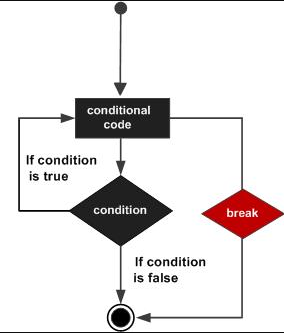

### 实例

```go
package main

import "fmt"

func main() {
   /* 定义局部变量 */
   var a int = 10

   /* for 循环 */
   for a < 20 {
      fmt.Printf("a 的值为 : %d\n", a)
      a++
      if a > 15 {
         /* 使用 break 语句跳出循环 */
         break
      }
   }
}
```

以上实例执行结果为：

```go
a 的值为 : 10
a 的值为 : 11
a 的值为 : 12
a 的值为 : 13
a 的值为 : 14
a 的值为 : 15
```

### continue语句

Go 语言的 continue 语句 有点像 break 语句。但是 continue 不是跳出循环，而是跳过当前循环执行下一次循环语句。

for 循环中，执行 continue 语句会触发for增量语句的执行。

### 语法

continue 语法格式如下：

```go
continue
```

continue 语句流程图如下：

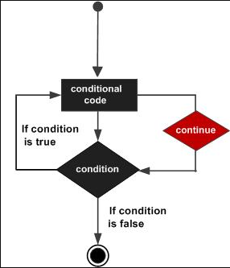

### 实例

```go
package main

import "fmt"

func main() {
   /* 定义局部变量 */
   var a int = 10

   /* for 循环 */
   for a < 20 {
      if a == 15 {
         /* 跳过此次循环 */
         a = a + 1
         continue
      }
      fmt.Printf("a 的值为 : %d\n", a)
      a++;     
   }  
}
```

以上实例执行结果为：

```go
a 的值为 : 10
a 的值为 : 11
a 的值为 : 12
a 的值为 : 13
a 的值为 : 14
a 的值为 : 16
a 的值为 : 17
a 的值为 : 18
a 的值为 : 19
```

### goto语句

Go 语言的 goto 语句可以无条件地转移到过程中指定的行。

goto语句通常与条件语句配合使用。可用来实现条件转移， 构成循环，跳出循环体等功能。

但是，在结构化程序设计中一般不主张使用goto语句， 以免造成程序流程的混乱，使理解和调试程序都产生困难。

### 语法

goto 语法格式如下：

```go
goto label
..
.
label: statement
```

break 语句流程图如下：

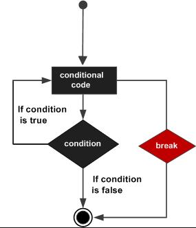

## 使用 goto 退出多层循环

下面这段代码在满足条件时，需要连续退出两层循环，使用传统的编码方式如下：

```go
package main
import "fmt"
func main() {
    var breakAgain bool
    // 外循环
    for x := 0; x < 10; x++ {
        // 内循环
        for y := 0; y < 10; y++ {
            // 满足某个条件时, 退出循环
            if y == 2 {
                // 设置退出标记
                breakAgain = true
                // 退出本次循环
                break
            }
        }
        // 根据标记, 还需要退出一次循环
        if breakAgain {
                break
        }
    }
    fmt.Println("done")
}
```

将上面的代码使用Go语言的 goto 语句进行优化：

```go
package main
import "fmt"
func main() {
    for x := 0; x < 10; x++ {
        for y := 0; y < 10; y++ {
            if y == 2 {
                // 跳转到标签
                goto breakHere
            }
        }
    }
    // 手动返回, 避免执行进入标签
    return
    // 标签
breakHere:
    fmt.Println("done")
}
```

## 使用 goto 集中处理错误

多处错误处理存在代码重复时是非常棘手的，例如：

```go
err := firstCheckError()
if err != nil {
    fmt.Println(err)
    exitProcess()
    return
}
err = secondCheckError()
if err != nil {
    fmt.Println(err)
    exitProcess()
    return
}
fmt.Println("done")
```

在上面代码中，有一部分都是重复的错误处理代码，如果后期在这些代码中添加更多的判断，就需要在这些雷同的代码中依次修改，极易造成疏忽和错误。
使用 goto 语句来实现同样的逻辑：

```go
    err := firstCheckError()
    if err != nil {
        goto onExit
    }
    err = secondCheckError()
    if err != nil {
        goto onExit
    }
    fmt.Println("done")
    return
onExit:
    fmt.Println(err)
    exitProcess()
```

## 无限循环

如过循环中条件语句永远不为 false 则会进行无限循环，我们可以通过 for 循环语句中只设置一个条件表达式来执行无限循环：

```go
package main

import "fmt"

func main() {
    for true  {
        fmt.Printf("这是无限循环。\n");
    }
}
```

---

# 函数

函数是基本的代码块，用于执行一个任务。

Go 语言最少有1个 main() 函数。

你可以通过函数来划分不同功能，逻辑上每个函数执行的是指定的任务。

函数声明告诉了编译器函数的名称，返回类型和参数。

Go 语言标准库提供了多种可动用的内置的函数。例如，len() 函数可以接受不同类型参数并返回该类型的长度。如果我们传入的是字符串则返回字符串的长度，如果传入的是数组，则返回数组中包含的分量个数。

------

## 函数定义

Go 语言函数定义格式如下：

```go
func function_name( [parameter list] ) [return_types]{
   函数体
}
```

函数定义解析：

- func：函数由 func 开始声明
- function_name：函数名称，函数名和参数列表一起构成了函数签名。
- parameter list]：参数列表，参数就像一个占位符，当函数被调用时，你可以将值传递给参数，这个值被称为实际参数。参数列表指定的是参数类型、顺序及参数个数。参数是可选的，也就是说函数也可以不包含参数。
- return_types：返回类型，函数返回一列值。return_types 是该列值的数据类型。有些功能不需要返回值，这种情况下 return_types 不是必须的。
- 函数体：函数定义的代码集合。

### 实例

以下实例为 max() 函数的代码，该函数传入两个整型参数 num1 和 num2，并返回这两个参数的最大值：

```go
/* 函数返回两个数的最大值 */
func max(num1, num2 int) int{
   /* 声明局部变量 */
   var result int

   if (num1 > num2) {
      result = num1
   } else {
      result = num2
   }
   return result 
}
```

## 函数调用

当创建函数时，你定义了函数需要做什么，通过调用该函数来执行指定任务。

调用函数，向函数传递参数，并返回值，例如：

```go
package main

import "fmt"

func main() {
   /* 定义局部变量 */
   var a int = 100
   var b int = 200
   var ret int

   /* 调用函数并返回最大值 */
   ret = max(a, b)

   fmt.Printf( "最大值是 : %d\n", ret )
}

/* 函数返回两个数的最大值 */
func max(num1, num2 int) int {
   /* 定义局部变量 */
   var result int

   if (num1 > num2) {
      result = num1
   } else {
      result = num2
   }
   return result 
}
```

以上实例在 main() 函数中调用 max（）函数，执行结果为：

```go
最大值是 : 200
```

------

## 函数返回多个值

Go 函数可以返回多个值，例如：

```go
package main

import "fmt"

func swap(x, y string) (string, string) {
   return y, x
}

func main() {
   a, b := swap("Mahesh", "Kumar")
   fmt.Println(a, b)
}
```

以上实例执行结果为：

```go
Kumar Mahesh
```

------

## 函数参数

函数如果使用参数，该变量可称为函数的形参。

形参就像定义在函数体内的局部变量。

调用函数，可以通过两种方式来传递参数：

| 传递类型 | 描述                                                         |
| :------- | :----------------------------------------------------------- |
| 值传递   | 值传递是指在调用函数时将实际参数复制一份传递到函数中，这样在函数中如果对参数进行修改，将不会影响到实际参数。 |
| 引用传递 | 引用传递是指在调用函数时将实际参数的地址传递到函数中，那么在函数中对参数所进行的修改，将影响到实际参数。 |

### 值传递

默认情况下，Go 语言使用的是值传递，即在调用过程中不会影响到实际参数。

传递是指在调用函数时将实际参数复制一份传递到函数中，这样在函数中如果对参数进行修改，将不会影响到实际参数。

默认情况下，Go 语言使用的是值传递，即在调用过程中不会影响到实际参数。

以下定义了 swap() 函数：

```go
/* 定义相互交换值的函数 */
func swap(x, y int) int {
   var temp int

   temp = x /* 保存 x 的值 */
   x = y    /* 将 y 值赋给 x */
   y = temp /* 将 temp 值赋给 y*/

   return temp;
}
```

接下来，让我们使用值传递来调用 swap() 函数：

```go
package main

import "fmt"

func main() {
   /* 定义局部变量 */
   var a int = 100
   var b int = 200

   fmt.Printf("交换前 a 的值为 : %d\n", a )
   fmt.Printf("交换前 b 的值为 : %d\n", b )

   /* 通过调用函数来交换值 */
   swap(a, b)

   fmt.Printf("交换后 a 的值 : %d\n", a )
   fmt.Printf("交换后 b 的值 : %d\n", b )
}

/* 定义相互交换值的函数 */
func swap(x, y int) int {
   var temp int

   temp = x /* 保存 x 的值 */
   x = y    /* 将 y 值赋给 x */
   y = temp /* 将 temp 值赋给 y*/

   return temp
}
```

以下代码执行结果为：

```go
交换前 a 的值为 : 100
交换前 b 的值为 : 200
交换后 a 的值 : 100
交换后 b 的值 : 200
```


### 引用传递

引用传递是指在调用函数时将实际参数的地址传递到函数中，那么在函数中对参数所进行的修改，将影响到实际参数。

引用传递将指针参数传递到函数内，以下是交换函数 swap() 使用了引用传递：

```go
/* 定义交换值函数*/
func swap(x *int, y *int) {
   var temp int
   temp = *x    /* 保持 x 地址上的值 */
   *x = *y      /* 将 y 值赋给 x */
   *y = temp    /* 将 temp 值赋给 y */
}
```

以下我们通过使用引用传递来调用 swap() 函数：

```go
package main

import "fmt"

func main() {
   /* 定义局部变量 */
   var a int = 100
   var b int= 200

   fmt.Printf("交换前，a 的值 : %d\n", a )
   fmt.Printf("交换前，b 的值 : %d\n", b )

   /* 调用 swap() 函数
   * &a 指向 a 指针，a 变量的地址
   * &b 指向 b 指针，b 变量的地址
   */
   swap(&a, &b)

   fmt.Printf("交换后，a 的值 : %d\n", a )
   fmt.Printf("交换后，b 的值 : %d\n", b )
}

func swap(x *int, y *int) {
   var temp int
   temp = *x    /* 保存 x 地址上的值 */
   *x = *y      /* 将 y 值赋给 x */
   *y = temp    /* 将 temp 值赋给 y */
}
```

以上代码执行结果为：

```go
交换前，a 的值 : 100
交换前，b 的值 : 200
交换后，a 的值 : 200
交换后，b 的值 : 100
```


## 函数用法

| 函数用法   | 描述                               |
| :--------- | :--------------------------------- |
| 函数作为值 | 函数定义后可作为值来使用           |
| 闭包       | 闭包是匿名函数，可在动态编程中使用 |
| 方法       | 方法就是一个包含了接受者的函数     |

### 函数作为值

Go 语言可以很灵活的创建函数，并作为值使用。以下实例中我们在定义的函数中初始化一个变量，该函数仅仅是为了使用内置函数 math.sqrt() ，实例为：

```go
package main

import (
   "fmt"
   "math"
)

func main(){
   /* 声明函数变量 */
   getSquareRoot := func(x float64) float64 {
      return math.Sqrt(x)
   }

   /* 使用函数 */
   fmt.Println(getSquareRoot(9))

}
```

以上代码执行结果为：

```go
3
```

### 闭包

Go 语言支持匿名函数，可作为闭包。匿名函数是一个"内联"语句或表达式。匿名函数的优越性在于可以直接使用函数内的变量，不必申明。

以下实例中，我们创建了函数 getSequence() ，返回另外一个函数。该函数的目的是在闭包中递增 i 变量，代码如下：

```go
package main

import "fmt"

func getSequence() func() int {
   i:=0
   return func() int {
      i+=1
     return i  
   }
}

func main(){
   /* nextNumber 为一个函数，函数 i 为 0 */
   nextNumber := getSequence()  

   /* 调用 nextNumber 函数，i 变量自增 1 并返回 */
   fmt.Println(nextNumber())
   fmt.Println(nextNumber())
   fmt.Println(nextNumber())
   
   /* 创建新的函数 nextNumber1，并查看结果 */
   nextNumber1 := getSequence()  
   fmt.Println(nextNumber1())
   fmt.Println(nextNumber1())
}
```

以上代码执行结果为：

```go
1
2
3
1
2
```

### 方法

Go 语言中同时有函数和方法。一个方法就是一个包含了接受者的函数，接受者可以是命名类型或者结构体类型的一个值或者是一个指针。所有给定类型的方法属于该类型的方法集。语法格式如下：

```go
func (variable_name variable_data_type) function_name() [return_type]{
   /* 函数体*/
}
```

下面定义一个结构体类型和该类型的一个方法：

```go
package main

import (
   "fmt"  
)

/* 定义函数 */
type Circle struct {
  radius float64
}

func main() {
  var c1 Circle
  c1.radius = 10.00
  fmt.Println("Area of Circle(c1) = ", c1.getArea())
}

//该 method 属于 Circle 类型对象中的方法
func (c Circle) getArea() float64 {
  //c.radius 即为 Circle 类型对象中的属性
  return 3.14 * c.radius * c.radius
}
```

以上代码执行结果为：

```go
Area of Circle(c1) =  314
```


## defer语句

Go语言中的defer语句会将其后面跟随的语句进行延迟处理

在defer所属的函数即将返回时，将延迟处理的语句按照defer定义的顺序逆序执行，即先进后出

```go
package main

import "fmt"

func main() {
	fmt.Println("开始")
	defer fmt.Println(1)
	defer fmt.Println(2)
	defer fmt.Println(3)
	fmt.Println("结束")
}
```

以上代码执行结果如下

```go
开始
结束
3
2
1
```

---

# 变量作用域

作用域为已声明标识符所表示的常量、类型、变量、函数或包在源代码中的作用范围。

Go 语言中变量可以在三个地方声明：

- 函数内定义的变量称为局部变量
- 函数外定义的变量称为全局变量
- 函数定义中的变量称为形式参数

接下来让我们具体了解局部变量、全局变量和形式参数。

------

## 局部变量

在函数体内声明的变量称之为局部变量，它们的作用域只在函数体内，参数和返回值变量也是局部变量。

以下实例中 main() 函数使用了局部变量 a, b, c：

```go
package main

import "fmt"

func main() {
   /* 声明局部变量 */
   var a, b, c int 

   /* 初始化参数 */
   a = 10
   b = 20
   c = a + b

   fmt.Printf ("结果： a = %d, b = %d and c = %d\n", a, b, c)
}
```

以上实例执行输出结果为：

```go
结果： a = 10, b = 20 and c = 30
```

------

## 全局变量

在函数体外声明的变量称之为全局变量，全局变量可以在整个包甚至外部包（被导出后）使用。

全局变量可以在任何函数中使用，以下实例演示了如何使用全局变量：

```go
package main

import "fmt"

/* 声明全局变量 */
var g int

func main() {

   /* 声明局部变量 */
   var a, b int

   /* 初始化参数 */
   a = 10
   b = 20
   g = a + b

   fmt.Printf("结果： a = %d, b = %d and g = %d\n", a, b, g)
}
```

以上实例执行输出结果为：

```go
结果： a = 10, b = 20 and g = 30
```

Go 语言程序中全局变量与局部变量名称可以相同，但是函数内的局部变量会被优先考虑。实例如下：

```go
package main

import "fmt"

/* 声明全局变量 */
var g int = 20

func main() {
   /* 声明局部变量 */
   var g int = 10

   fmt.Printf ("结果： g = %d\n",  g)
}
```

以上实例执行输出结果为：

```go
结果： g = 10
```

------

## 形式参数

形式参数会作为函数的局部变量来使用。实例如下：

```go
package main

import "fmt"

/* 声明全局变量 */
var a int = 20

func main() {
   /* main 函数中声明局部变量 */
   var a int = 10
   var b int = 20
   var c int = 0

   fmt.Printf("main()函数中 a = %d\n",  a)
   c = sum( a, b);
   fmt.Printf("main()函数中 c = %d\n",  c)
}

/* 函数定义-两数相加 */
func sum(a, b int) int {
   fmt.Printf("sum() 函数中 a = %d\n",  a)
   fmt.Printf("sum() 函数中 b = %d\n",  b)

   return a + b
}
```

以上实例执行输出结果为：

```go
main()函数中 a = 10
sum() 函数中 a = 10
sum() 函数中 b = 20
main()函数中 c = 30
```

------

## 初始化局部和全局变量

不同类型的局部和全局变量默认值为：

| 数据类型 | 初始化默认值 |
| :------- | :----------- |
| int      | 0            |
| float32  | 0            |
| pointer  | nil          |

---

# 数组

Go 语言提供了数组类型的数据结构。

数组是具有相同唯一类型的一组已编号且长度固定的数据项序列，这种类型可以是任意的原始类型例如整型、字符串或者自定义类型。

相对于去声明number0, number1, ..., and number99的变量，使用数组形式numbers[0], numbers[1] ..., numbers[99]更加方便且易于扩展。

数组元素可以通过索引（位置）来读取（或者修改），索引从0开始，第一个元素索引为 0，第二个索引为 1，以此类推。

## 声明数组

Go 语言数组声明需要指定元素类型及元素个数，语法格式如下：

```go
var variable_name [SIZE] variable_type
```

以上为一维数组的定义方式。数组长度必须是整数且大于 0。例如以下定义了数组 balance 长度为 10，类型为 float32：

```go
var balance [10] float32
```

------

## 初始化数组

以下演示了数组初始化：

```go
var balance = [5]float32{1000.0, 2.0, 3.4, 7.0, 50.0}
```

初始化数组中 {} 中的元素个数不能大于 [] 中的数字。

如果忽略 [] 中的数字不设置数组大小，Go 语言会根据元素的个数来设置数组的大小：

```go
 var balance = []float32{1000.0, 2.0, 3.4, 7.0, 50.0}
```

该实例与上面的实例是一样的，虽然没有设置数组的大小。

```go
 balance[4] = 50.0
```

以上实例读取了第五个元素。数组元素可以通过索引（位置）来读取（或者修改），索引从0开始，第一个元素索引为 0，第二个索引为 1，以此类推。


## 访问数组元素

数组元素可以通过索引（位置）来读取。格式为数组名后加中括号，中括号中为索引的值。例如：

```go
float32 salary = balance[9]
```

以上实例读取了数组balance第10个元素的值。

以下演示了数组完整操作（声明、赋值、访问）的实例：

```go
package main

import "fmt"

func main() {
   var n [10]int /* n 是一个长度为 10 的数组 */
   var i,j int

   /* 为数组 n 初始化元素 */         
   for i = 0; i < 10; i++ {
      n[i] = i + 100 /* 设置元素为 i + 100 */
   }

   /* 输出每个数组元素的值 */
   for j = 0; j < 10; j++ {
      fmt.Printf("Element[%d] = %d\n", j, n[j] )
   }
}
```

以上实例执行结果如下：

```go
Element[0] = 100
Element[1] = 101
Element[2] = 102
Element[3] = 103
Element[4] = 104
Element[5] = 105
Element[6] = 106
Element[7] = 107
Element[8] = 108
Element[9] = 109
```

------

数组对 Go 语言来说是非常重要的，以下我们将介绍数组更多的内容：

| 内容                                                         | 描述                                            |
| :----------------------------------------------------------- | :---------------------------------------------- |
| [多维数组](https://www.w3cschool.cn/go/go-multi-dimensional-arrays.html) | Go 语言支持多维数组，最简单的多维数组是二维数组 |
| [向函数传递数组](https://www.w3cschool.cn/go/go-passing-arrays-to-functions.html) | 你可以像函数传递数组参数                        |

## 多维数组

```go
var variable_name [SIZE1][SIZE2]...[SIZEN] variable_type
```

以下实例声明了三维的整型数组：

```go
var threedim [5][10][4]int
```

------

### 二维数组

二维数组是最简单的多维数组，二维数组本质上是由一维数组组成的。二维数组定义方式如下：

```go
var arrayName [x][y] variable_type
```

variable_type 为 Go 语言的数据类型，arrayName 为数组名，二维数组可认为是一个表格，x 为行，y 为列，下图演示了一个二维数组 a 为三行四列：

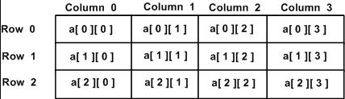

二维数组中的元素可通过 `a[i][j]`来访问。

------

### 初始化二维数组

多维数组可通过大括号来初始值。以下实例为一个 3 行 4 列的二维数组：

```go
a = [3][4] int{  
 {0, 1, 2, 3} ,   /*  第一行索引为 0 */
 {4, 5, 6, 7} ,   /*  第二行索引为 1 */
 {8, 9, 10, 11}   /*  第三行索引为 2 */
}
```

------

### 访问二维数组

二维数组通过指定坐标来访问。如数组中的行索引与列索引，例如：

```go
int val = a[2][3]
```

以上实例访问了二维数组 val 第三行的第四个元素。

二维数组可以使用循环嵌套来输出元素：

```go
package main

import "fmt"

func main() {
   /* 数组 - 5 行 2 列*/
   var a = [5][2]int{ {0,0}, {1,2}, {2,4}, {3,6},{4,8}}
   var i, j int

   /* 输出数组元素 */
   for  i = 0; i < 5; i++ {
      for j = 0; j < 2; j++ {
         fmt.Printf("a[%d][%d] = %d\n", i,j, a[i][j] )
      }
   }
}
```

以上实例运行输出结果为：

```go
a[0][0] = 0
a[0][1] = 0
a[1][0] = 1
a[1][1] = 2
a[2][0] = 2
a[2][1] = 4
a[3][0] = 3
a[3][1] = 6
a[4][0] = 4
a[4][1] = 8
```

## 向函数传递数组

如果你想向函数传递数组参数，你需要在函数定义时，声明形参为数组，我们可以通过以下两种方式来声明：

### 方式一

形参设定数组大小：

```go
void myFunction(param [10]int){
    ...
}
```

### 方式二

形参未设定数组大小：

```go
void myFunction(param []int){
    ...
}
```

### 实例

让我们看下以下实例，实例中函数接收整型数组参数，另一个参数指定了数组元素的个数，并返回平均值：

```go
func getAverage(arr []int,size int) float32{
   var i int
   var avg, sum float32  

   for i = 0; i < size; ++i {
      sum += arr[i]
   }

   avg = sum / size

   return avg
}
```

接下来我们来调用这个函数：

```go
package main

import "fmt"

func main() {
   /* 数组长度为 5 */
   var  balance = [5]int {1000, 2, 3, 17, 50}
   var avg float32

   /* 数组作为参数传递给函数 */
   avg = getAverage( balance, 5 ) ;

   /* 输出返回的平均值 */
   fmt.Printf( "平均值为: %f ", avg );
}
func getAverage(arr [5]int, size int) float32 {
   var i,sum int
   var avg float32  

   for i = 0; i < size;i++ {
      sum += arr[i]
   }

   avg = float32(sum) / float32(size)

   return avg;
}
```

以上实例执行输出结果为：

```go
平均值为: 214.399994
```

---

# 指针

Go 语言中指针是很容易学习的，Go 语言中使用指针可以更简单的执行一些任务。

接下来让我们来一步步学习 Go 语言指针。

我们都知道，变量是一种使用方便的占位符，用于引用计算机内存地址。

Go 语言的取地址符是 &，放到一个变量前使用就会返回相应变量的内存地址。

以下实例演示了变量在内存中地址：

```
package main

import "fmt"

func main() {
   var a int = 10   

   fmt.Printf("变量的地址: %x\n", &a  )
}
```

执行以上代码输出结果为：

```
变量的地址: 20818a220
```

现在我们已经了解了什么是内存地址和如何去访问它。接下来我们将具体介绍指针。

------

## 什么是指针

一个指针变量可以指向任何一个值的内存地址它指向那个值的内存地址。

类似于变量和常量，在使用指针前你需要声明指针。指针声明格式如下：

```go
var var_name *var-type
```

var-type 为指针类型，var_name 为指针变量名，* 号用于指定变量是作为一个指针。以下是有效的指针声明：

```go
var ip *int        /* 指向整型*/
var fp *float32    /* 指向浮点型 */
```

本例中这是一个指向 int 和 float32 的指针。

------

## 如何使用指针

指针使用流程：

- 定义指针变量。
- 为指针变量赋值。
- 访问指针变量中指向地址的值。

在指针类型前面加上 * 号（前缀）来获取指针所指向的内容。

```go
package main

import "fmt"

func main() {
   var a int= 20   /* 声明实际变量 */
   var ip *int        /* 声明指针变量 */

   ip = &a  /* 指针变量的存储地址 */

   fmt.Printf("a 变量的地址是: %x\n", &a  )

   /* 指针变量的存储地址 */
   fmt.Printf("ip 变量的存储地址: %x\n", ip )

   /* 使用指针访问值 */
   fmt.Printf("*ip 变量的值: %d\n", *ip )
}
```

以上实例执行输出结果为：

```go
a 变量的地址是: 20818a220
ip 变量的存储地址: 20818a220
*ip 变量的值: 20
```

------

## 空指针

当一个指针被定义后没有分配到任何变量时，它的值为 nil。

nil 指针也称为空指针。

nil在概念上和其它语言的null、None、nil、NULL一样，都指代零值或空值。

一个指针变量通常缩写为 ptr。

查看以下实例：

```go
package main

import "fmt"

func main() {
   var  ptr *int
   fmt.Printf("ptr 的值为 : %v\n", ptr  )
   fmt.Printf("ptr 的值为 : %#v\n", ptr  )

}
```

以上实例输出结果为：

```go
ptr 的值为 : <nil>
ptr 的值为 : (*int)(nil)
```

空指针判断：

```go
if(ptr != nil)     /* ptr 不是空指针 */
if(ptr == nil)    /* ptr 是空指针 */
```

------

## 指针数组

在我们了解指针数组前，先看个实例，定义了长度为 3 的整型数组：

```go
package main

import "fmt"

const MAX int = 3

func main() {

   a := []int{10,100,200}
   var i int

   for i = 0; i < MAX; i++ {
      fmt.Printf("a[%d] = %d\n", i, a[i] )
   }
}
```

以上代码执行输出结果为：

```go
a[0] = 10
a[1] = 100
a[2] = 200
```

有一种情况，我们可能需要保存数组，这样我们就需要使用到指针。

以下声明了整型指针数组：

```go
var ptr [MAX]*int
```

ptr 为整型指针数组。因此每个元素都指向了一个值。以下实例的三个整数将存储在指针数组中：

```go
package main

import "fmt"

const MAX int = 3

func main() {
   a := []int{10,100,200}
   var i int
   var ptr [MAX]*int

   for  i = 0; i < MAX; i++ {
      ptr[i] = &a[i] /* 整数地址赋值给指针数组 */
   }

   for  i = 0; i < MAX; i++ {
      fmt.Printf("a[%d] = %d\n", i,*ptr[i] )
   }
}
```

以上代码执行输出结果为：

```go
a[0] = 10
a[1] = 100
a[2] = 200
```

## 指向指针的指针

如果一个指针变量存放的又是另一个指针变量的地址，则称这个指针变量为指向指针的指针变量。

当定义一个指向指针的指针变量时，第一个指针存放第二个指针的地址，第二个指针存放变量的地址：


指向指针的指针变量声明格式如下：

```go
var ptr **int
```

以上指向指针的指针变量为整型。

访问指向指针的指针变量值需要使用两个 * 号，如下所示：

```go
package main

import "fmt"

func main() {

   var a int
   var ptr *int
   var pptr **int

   a = 3000

   /* 指针 ptr 地址 */
   ptr = &a

   /* 指向指针 ptr 地址 */
   pptr = &ptr

   /* 获取 pptr 的值 */
   fmt.Printf("变量 a = %d\n", a )
   fmt.Printf("指针变量 *ptr = %d\n", *ptr )
   fmt.Printf("指向指针的指针变量 **pptr = %d\n", **pptr)
}
```

以上实例执行输出结果为：

```go
变量 a = 3000
指针变量 *ptr = 3000
指向指针的指针变量 **pptr = 3000
```

## 指针作为函数参数

Go 语言允许向函数传递指针，只需要在函数定义的参数上设置为指针类型即可。

以下实例演示了如何向函数传递指针，并在函数调用后修改函数内的值，：

```go
package main

import "fmt"

func main() {
   /* 定义局部变量 */
   var a int = 100
   var b int= 200

   fmt.Printf("交换前 a 的值 : %d\n", a )
   fmt.Printf("交换前 b 的值 : %d\n", b )

   /* 调用函数用于交换值
   * &a 指向 a 变量的地址
   * &b 指向 b 变量的地址
   */
   swap(&a, &b)

   fmt.Printf("交换后 a 的值 : %d\n", a )
   fmt.Printf("交换后 b 的值 : %d\n", b )
}

func swap(x *int, y *int) {
   var temp int
   temp = *x    /* 保存 x 地址的值 */
   *x = *y      /* 将 y 赋值给 x */
   *y = temp    /* 将 temp 赋值给 y */
}
```

以上实例允许输出结果为：

```go
交换前 a 的值 : 100
交换前 b 的值 : 200
交换后 a 的值 : 200
交换后 b 的值 : 100
```

---

# 结构体

Go 语言中数组可以存储同一类型的数据，但在结构体中我们可以为不同项定义不同的数据类型。

结构体是由一系列具有相同类型或不同类型的数据构成的数据集合。

结构体表示一项记录，比如保存图书馆的书籍记录，每本书有以下属性：

- Title ：标题
- Author ： 作者
- Subject：学科
- ID：书籍ID

------

## 定义结构体

结构体定义需要使用 type 和 struct 语句。struct 语句定义一个新的数据类型，结构体中有一个或多个成员。type 语句设定了结构体的名称。结构体的格式如下：

```go
type struct_variable_type struct {
   member definition
   member definition
   ...
   member definition
}
```

一旦定义了结构体类型，它就能用于变量的声明，语法格式如下：

```go
variable_name := structure_variable_type {value1, value2...valuen}
```

------

## 访问结构体成员

如果要访问结构体成员，需要使用点号 (.) 操作符，格式为："结构体.成员名"。

结构体类型变量使用struct关键字定义，实例如下：

```go
package main

import "fmt"

type Books struct {
   title string
   author string
   subject string
   book_id int
}

func main() {
   var Book1 Books        /* 声明 Book1 为 Books 类型 */
   var Book2 Books        /* 声明 Book2 为 Books 类型 */

   /* book 1 描述 */
   Book1.title = "Go 语言"
   Book1.author = "www.w3cschool.cn"
   Book1.subject = "Go 语言教程"
   Book1.book_id = 6495407

   /* book 2 描述 */
   Book2.title = "Python 教程"
   Book2.author = "www.w3cschool.cn"
   Book2.subject = "Python 语言教程"
   Book2.book_id = 6495700

   /* 打印 Book1 信息 */
   fmt.Printf( "Book 1 title : %s\n", Book1.title)
   fmt.Printf( "Book 1 author : %s\n", Book1.author)
   fmt.Printf( "Book 1 subject : %s\n", Book1.subject)
   fmt.Printf( "Book 1 book_id : %d\n", Book1.book_id)

   /* 打印 Book2 信息 */
   fmt.Printf( "Book 2 title : %s\n", Book2.title)
   fmt.Printf( "Book 2 author : %s\n", Book2.author)
   fmt.Printf( "Book 2 subject : %s\n", Book2.subject)
   fmt.Printf( "Book 2 book_id : %d\n", Book2.book_id)
}
```

以上实例执行运行结果为：

```go
Book 1 title : Go 语言
Book 1 author : www.w3cschool.cn
Book 1 subject : Go 语言教程
Book 1 book_id : 6495407
Book 2 title : Python 教程
Book 2 author : www.w3cschool.cn
Book 2 subject : Python 语言教程
Book 2 book_id : 6495700
```

------

## 结构体作为函数参数

你可以向其他数据类型一样将结构体类型作为参数传递给函数。并以以上实例的方式访问结构体变量：

```go
package main

import "fmt"

type Books struct {
   title string
   author string
   subject string
   book_id int
}

func main() {
   var Book1 Books        /* 声明 Book1 为 Books 类型 */
   var Book2 Books        /* 声明 Book2 为 Books 类型 */

   /* book 1 描述 */
   Book1.title = "Go 语言"
   Book1.author = "www.w3cschool.cn"
   Book1.subject = "Go 语言教程"
   Book1.book_id = 6495407

   /* book 2 描述 */
   Book2.title = "Python 教程"
   Book2.author = "www.w3cschool.cn"
   Book2.subject = "Python 语言教程"
   Book2.book_id = 6495700

   /* 打印 Book1 信息 */
   printBook(Book1)

   /* 打印 Book2 信息 */
   printBook(Book2)
}

func printBook( book Books ) {
   fmt.Printf( "Book title : %s\n", book.title)
   fmt.Printf( "Book author : %s\n", book.author)
   fmt.Printf( "Book subject : %s\n", book.subject)
   fmt.Printf( "Book book_id : %d\n", book.book_id)
}
```

以上实例执行运行结果为：

```go
Book title : Go 语言
Book author : www.w3cschool.cn
Book subject : Go 语言教程
Book book_id : 6495407
Book title : Python 教程
Book author : www.w3cschool.cn
Book subject : Python 语言教程
Book book_id : 6495700
```

------

## 结构体指针

你可以定义指向结构体的指针类似于其他指针变量，格式如下：

```go
var struct_pointer *Books
```

以上定义的指针变量可以存储结构体变量的地址。查看结构体变量地址，可以将 & 符号放置于结构体变量前：

```go
struct_pointer = &Book1
```

使用结构体指针访问结构体成员，使用 "." 操作符：

```go
struct_pointer.title
```

接下来让我们使用结构体指针重写以上实例，代码如下：

```go
package main

import "fmt"

type Books struct {
   title string
   author string
   subject string
   book_id int
}

func main() {
   var Book1 Books        /* Declare Book1 of type Book */
   var Book2 Books        /* Declare Book2 of type Book */

   /* book 1 描述 */
   Book1.title = "Go 语言"
   Book1.author = "www.w3cschool.cn"
   Book1.subject = "Go 语言教程"
   Book1.book_id = 6495407

   /* book 2 描述 */
   Book2.title = "Python 教程"
   Book2.author = "www.w3cschool.cn"
   Book2.subject = "Python 语言教程"
   Book2.book_id = 6495700

   /* 打印 Book1 信息 */
   printBook(&Book1)

   /* 打印 Book2 信息 */
   printBook(&Book2)
}
func printBook( book *Books ) {
   fmt.Printf( "Book title : %s\n", book.title)
   fmt.Printf( "Book author : %s\n", book.author)
   fmt.Printf( "Book subject : %s\n", book.subject)
   fmt.Printf( "Book book_id : %d\n", book.book_id)
}
```

以上实例执行运行结果为：

```go
Book title : Go 语言
Book author : www.w3cschool.cn
Book subject : Go 语言教程
Book book_id : 6495407
Book title : Python 教程
Book author : www.w3cschool.cn
Book subject : Python 语言教程
Book book_id : 6495700
```

---

# 切片(Slice)

Go 语言切片是对数组的抽象。

Go 数组的长度不可改变，在特定场景中这样的集合就不太适用，Go中提供了一种灵活，功能强悍的内置类型切片("动态数组"),与数组相比切片的长度是不固定的，可以追加元素，在追加时可能使切片的容量增大。

------

## 定义切片

你可以声明一个未指定大小的数组来定义切片：

```go
var identifier []type
```

切片不需要说明长度。

或使用make()函数来创建切片:

```go
var slice1 []type = make([]type, len)
```

也可以简写为

```go
slice1 := make([]type, len)
```

也可以指定容量，其中capacity为可选参数。

```go
make([]T, length, capacity)
```

这里 len 是数组的长度并且也是切片的初始长度。

## 切片初始化

```go
s :=[] int {1,2,3 } 
```

直接初始化切片，[]表示是切片类型，{1,2,3}初始化值依次是1,2,3.其cap=len=3

```go
s := arr[:] 
```

初始化切片s,是数组arr的引用

```go
s := arr[startIndex:endIndex] 
```

将arr中从下标startIndex到endIndex-1 下的元素创建为一个新的切片

```go
s := arr[startIndex:] 
```

缺省endIndex时将表示一直到arr的最后一个元素

```go
s := arr[:endIndex] 
```

缺省startIndex时将表示从arr的第一个元素开始

```go
s1 := s[startIndex:endIndex] 
```

通过切片s初始化切片s1

```go
s := make([]int,len,cap) 
```

通过内置函数make()初始化切片s,[]int 标识为其元素类型为int的切片

------

## len() 和 cap() 函数

切片是可索引的，并且可以由 len() 方法获取长度。

切片提供了计算容量的方法 cap() 可以测量切片最长可以达到多少。

以下为具体实例：

```go
package main

import "fmt"

func main() {
   var numbers = make([]int,3,5)

   printSlice(numbers)
}

func printSlice(x []int){
   fmt.Printf("len=%d cap=%d slice=%v\n",len(x),cap(x),x)
}
```

以上实例运行输出结果为:

```go
len=3 cap=5 slice=[0 0 0]
```

------

## 空(nil)切片

一个切片在未初始化之前默认为 nil，长度为 0，实例如下：

```go
package main

import "fmt"

func main() {
   var numbers []int

   printSlice(numbers)

   if(numbers == nil){
      fmt.Printf("切片是空的")
   }
}

func printSlice(x []int){
   fmt.Printf("len=%d cap=%d slice=%v\n",len(x),cap(x),x)
}
```

以上实例运行输出结果为:

```go
len=0 cap=0 slice=[]
切片是空的
```

------

## 切片截取

可以通过设置下限及上限来设置截取切片 *[lower-bound:upper-bound]*，实例如下：

```go
package main

import "fmt"

func main() {
   /* 创建切片 */
   numbers := []int{0,1,2,3,4,5,6,7,8}   
   printSlice(numbers)

   /* 打印原始切片 */
   fmt.Println("numbers ==", numbers)

   /* 打印子切片从索引1(包含) 到索引4(不包含)*/
   fmt.Println("numbers[1:4] ==", numbers[1:4])

   /* 默认下限为 0*/
   fmt.Println("numbers[:3] ==", numbers[:3])

   /* 默认上限为 len(s)*/
   fmt.Println("numbers[4:] ==", numbers[4:])

   numbers1 := make([]int,0,5)
   printSlice(numbers1)

   /* 打印子切片从索引  0(包含) 到索引 2(不包含) */
   number2 := numbers[:2]
   printSlice(number2)

   /* 打印子切片从索引 2(包含) 到索引 5(不包含) */
   number3 := numbers[2:5]
   printSlice(number3)

}

func printSlice(x []int){
   fmt.Printf("len=%d cap=%d slice=%v\n",len(x),cap(x),x)
}
```

执行以上代码输出结果为：

```go
len=9 cap=9 slice=[0 1 2 3 4 5 6 7 8]
numbers == [0 1 2 3 4 5 6 7 8]
numbers[1:4] == [1 2 3]
numbers[:3] == [0 1 2]
numbers[4:] == [4 5 6 7 8]
len=0 cap=5 slice=[]
len=2 cap=9 slice=[0 1]
len=3 cap=7 slice=[2 3 4]
```

------

## append() 和 copy() 函数

如果想增加切片的容量，我们必须创建一个新的更大的切片并把原分片的内容都拷贝过来。

下面的代码描述了从拷贝切片的 copy 方法和向切片追加新元素的 append 方法。

```go
package main

import "fmt"

func main() {
   var numbers []int
   printSlice(numbers)

   /* 允许追加空切片 */
   numbers = append(numbers, 0)
   printSlice(numbers)

   /* 向切片添加一个元素 */
   numbers = append(numbers, 1)
   printSlice(numbers)

   /* 同时添加多个元素 */
   numbers = append(numbers, 2,3,4)
   printSlice(numbers)

   /* 创建切片 numbers1 是之前切片的两倍容量*/
   numbers1 := make([]int, len(numbers), (cap(numbers))*2)

   /* 拷贝 numbers 的内容到 numbers1 */
   copy(numbers1,numbers)
   printSlice(numbers1)   
}

func printSlice(x []int){
   fmt.Printf("len=%d cap=%d slice=%v\n",len(x),cap(x),x)
}
```

以上代码执行输出结果为：

```go
len=0 cap=0 slice=[]
len=1 cap=1 slice=[0]
len=2 cap=2 slice=[0 1]       
len=5 cap=6 slice=[0 1 2 3 4] 
len=5 cap=12 slice=[0 1 2 3 4]
```

---

# 范围(Range)

Go 语言中 range 关键字用于for循环中迭代数组(array)、切片(slice)、通道(channel)或集合(map)的元素。在数组和切片中它返回元素的索引值，在集合中返回 key-value 对的 key 值。

对于映射，它返回下一个键值对的键。Range返回一个值或两个值。如果在Range表达式的左侧只使用了一个值，则该值是下表中的第一个值。

| Range表达式             | 第一个值   | 第二个值[可选的] |
| ----------------------- | ---------- | ---------------- |
| Array 或者 slice a [n]E | 索引 i int | a[i] E           |
| String s string type    | 索引 i int | rune int         |
| map m map[K]V           | 键 k K     | 值 m[k] V        |
| channel c chan E        | 元素 e E   | none             |

## 实例

```go
package main
import "fmt"
func main() {
    //这是我们使用range去求一个slice的和。使用数组跟这个很类似
    nums := []int{2, 3, 4}
    sum := 0
    for _, num := range nums {
        sum += num
    }
    fmt.Println("sum:", sum)
    //在数组上使用range将传入index和值两个变量。上面那个例子我们不需要使用该元素的序号，所以我们使用空白符"_"省略了。有时侯我们确实需要知道它的索引。
    for i, num := range nums {
        if num == 3 {
            fmt.Println("index:", i)
        }
    }
    //range也可以用在map的键值对上。
    kvs := map[string]string{"a": "apple", "b": "banana"}
    for k, v := range kvs {
        fmt.Printf("%s -> %s\n", k, v)
    }
    //range也可以用来枚举Unicode字符串。第一个参数是字符的索引，第二个是字符（Unicode的值）本身。
    for i, c := range "go" {
        fmt.Println(i, c)
    }
}
```

以上实例运行输出结果为：

```go
sum: 9
index: 1
a -> apple
b -> banana
0 103
1 111
```

---

# 集合(Map)

Map 是一种无序的键值对的集合。Map 最重要的一点是通过 key 来快速检索数据，key 类似于索引，指向数据的值。

Map 是一种集合，所以我们可以像迭代数组和切片那样迭代它。不过，Map 是无序的，我们无法决定它的返回顺序，这是因为 Map 是使用 hash 表来实现的。

## 定义 Map

可以使用内建函数 make 也可以使用 map 关键字来定义 Map:

```go
/* 声明变量，默认 map 是 nil */
var map_variable map[key_data_type]value_data_type

/* 使用 make 函数 */
map_variable = make(map[key_data_type]value_data_type)
```

如果不初始化 map，那么就会创建一个 nil map。nil map 不能用来存放键值对

## 实例

下面实例演示了创建和使用map:

```go
package main

import "fmt"

func main() {
   var countryCapitalMap map[string]string
   /* 创建集合 */
   countryCapitalMap = make(map[string]string)
   
   /* map 插入 key-value 对，各个国家对应的首都 */
   countryCapitalMap["France"] = "Paris"
   countryCapitalMap["Italy"] = "Rome"
   countryCapitalMap["Japan"] = "Tokyo"
   countryCapitalMap["India"] = "New Delhi"
   
   /* 使用 key 输出 map 值 */
   for country := range countryCapitalMap {
      fmt.Println("Capital of",country,"is",countryCapitalMap[country])
   }
   
   /* 查看元素在集合中是否存在 */
   captial, ok := countryCapitalMap["United States"]
   /* 如果 ok 是 true, 则存在，否则不存在 */
   if(ok){
      fmt.Println("Capital of United States is", captial)  
   }else {
      fmt.Println("Capital of United States is not present") 
   }
}
```

以上实例运行结果为：

```go
Capital of France is Paris
Capital of Italy is Rome
Capital of Japan is Tokyo
Capital of India is New Delhi
Capital of United States is not present
```

------

## delete() 函数

delete() 函数用于删除集合的元素, 参数为 map 和其对应的 key。实例如下：

```go
package main

import "fmt"

func main() {   
   /* 创建 map */
   countryCapitalMap := map[string] string {"France":"Paris","Italy":"Rome","Japan":"Tokyo","India":"New Delhi"}
   
   fmt.Println("原始 map")   
   
   /* 打印 map */
   for country := range countryCapitalMap {
      fmt.Println("Capital of",country,"is",countryCapitalMap[country])
   }
   
   /* 删除元素 */
   delete(countryCapitalMap,"France");
   fmt.Println("Entry for France is deleted")  
   
   fmt.Println("删除元素后 map")   
   
   /* 打印 map */
   for country := range countryCapitalMap {
      fmt.Println("Capital of",country,"is",countryCapitalMap[country])
   }
}
```

以上实例运行结果为：

```go
原始 map
Capital of France is Paris
Capital of Italy is Rome
Capital of Japan is Tokyo
Capital of India is New Delhi
Entry for France is deleted
删除元素后 map
Capital of Italy is Rome
Capital of Japan is Tokyo
Capital of India is New Delhi
```

---

# 递归函数

递归，就是在运行的过程中调用自己。

语法格式如下：

```go
func recursion() {
   recursion() /* 函数调用自身 */
}

func main() {
   recursion()
}
```

Go 语言支持递归。但我们在使用递归时，开发者需要设置退出条件，否则递归将陷入无限循环中。

递归函数对于解决数学上的问题是非常有用的，就像计算阶乘，生成斐波那契数列等。

------

## 阶乘

以下实例通过 Go 语言的递归函数实例阶乘：

```go
package main

import "fmt"

func Factorial(x int) (result int) {
  if x == 0 {
    result = 1   
  } else {
    result = x * Factorial(x - 1)
  }
  return
}

func main() {  
    var i int = 15
    fmt.Printf("%d 的阶乘是 %d\n", i, Factorial(i))
}
```

以上实例执行输出结果为：

```go
15 的阶乘是 1307674368000
```

------

## 斐波那契数列

以下实例通过 Go 语言的递归函数实现斐波那契数列：

```go
package main

import "fmt"

func fibonacci(n int) int {
  if n < 2 {
   return n
  }
  return fibonacci(n-2) + fibonacci(n-1)
}

func main() {
    var i int
    for i = 0; i < 10; i++ {
       fmt.Printf("%d\t", fibonacci(i))
    }
}
```

以上实例执行输出结果为：

```go
0   1   1   2   3   5   8   13  21  34
```

---

# 类型转换

类型转换用于将一种数据类型的变量转换为另外一种类型的变量。Go 语言类型转换基本格式如下：

```go
type_name(expression)
```

type_name 为类型，expression 为表达式。

## 实例

以下实例中将整型转化为浮点型，并计算结果，将结果赋值给浮点型变量：

```go
package main

import "fmt"

func main() {
   var sum int = 17
   var count int = 5
   var mean float32
   
   mean = float32(sum)/float32(count)
   fmt.Printf("mean 的值为: %f\n",mean)
}
```

以上实例执行输出结果为：

```go
mean 的值为: 3.400000
```


## go 不支持隐式转换类型

示例：

```go
package main
import "fmt"

func main() {  
    var a int64 = 3
    var b int32
    b = a
    fmt.Printf("b 为 : %d", b)
}
```

此时会报错

```go
cannot use a (type int64) as type int32 in assignment
cannot use b (type int32) as type string in argument to fmt.Printf
```

但是如果改成 `b = int32(a) `就不会报错了:

```go
package main
import "fmt"

func main() {  
    var a int64 = 3
    var b int32
    b = int32(a)
    fmt.Printf("b 为 : %d", b)
}
```

---

# 接口

Go 语言提供了另外一种数据类型即接口，它把所有的具有共性的方法定义在一起，任何其他类型只要实现了这些方法就是实现了这个接口。

## 实例

```go
/* 定义接口 */
type interface_name interface {
   method_name1 [return_type]
   method_name2 [return_type]
   method_name3 [return_type]
   ...
   method_namen [return_type]
}

/* 定义结构体 */
type struct_name struct {
   /* variables */
}

/* 实现接口方法 */
func (struct_name_variable struct_name) method_name1() [return_type] {
   /* 方法实现 */
}
...
func (struct_name_variable struct_name) method_namen() [return_type] {
   /* 方法实现*/
}
```

## 实例

```go
package main

import (
    "fmt"
)

type Phone interface {
    call()
}

type NokiaPhone struct {
}

func (nokiaPhone NokiaPhone) call() {
    fmt.Println("I am Nokia, I can call you!")
}

type IPhone struct {
}

func (iPhone IPhone) call() {
    fmt.Println("I am iPhone, I can call you!")
}

func main() {
    var phone Phone

    phone = new(NokiaPhone)
    phone.call()

    phone = new(IPhone)
    phone.call()

}
```

在上面的例子中，我们定义了一个接口Phone，接口里面有一个方法call()。然后我们在main函数里面定义了一个Phone类型变量，并分别为之赋值为NokiaPhone和IPhone。然后调用call()方法，输出结果如下：

```go
I am Nokia, I can call you!
I am iPhone, I can call you!
```

---

# 错误处理

Go 语言通过内置的错误接口提供了非常简单的错误处理机制。

error类型是一个接口类型，这是它的定义：

```go
type error interface {
    Error() string
}
```

我们可以在编码中通过实现 error 接口类型来生成错误信息。

函数通常在最后的返回值中返回错误信息。使用errors.New 可返回一个错误信息：

```go
func Sqrt(f float64) (float64, error) {
    if f < 0 {
        return 0, errors.New("math: square root of negative number")
    }
    // 实现
}
```

在下面的例子中，我们在调用Sqrt的时候传递的一个负数，然后就得到了non-nil的error对象，将此对象与nil比较，结果为true，所以fmt.Println(fmt包在处理error时会调用Error方法)被调用，以输出错误，请看下面调用的示例代码：

```go
result, err:= Sqrt(-1)

if err != nil {
   fmt.Println(err)
}
```

## 实例

```go
package main

import (
    "fmt"
)

// 定义一个 DivideError 结构
type DivideError struct {
    dividee int
    divider int
}

// 实现 `error` 接口
func (de *DivideError) Error() string {
    strFormat := `
    Cannot proceed, the divider is zero.
    dividee: %d
    divider: 0
`
    return fmt.Sprintf(strFormat, de.dividee)
}

// 定义 `int` 类型除法运算的函数
func Divide(varDividee int, varDivider int) (result int, errorMsg string) {
    if varDivider == 0 {
            dData := DivideError{
                    dividee: varDividee,
                    divider: varDivider,
            }
            errorMsg = dData.Error()
            return
    } else {
            return varDividee / varDivider, ""
    }

}

func main() {

    // 正常情况
    if result, errorMsg := Divide(100, 10); errorMsg == "" {
            fmt.Println("100/10 = ", result)
    }
    // 当被除数为零的时候会返回错误信息
    if _, errorMsg := Divide(100, 0); errorMsg != "" {
            fmt.Println("errorMsg is: ", errorMsg)
    }

}
```

执行以上程序，输出结果为：

```go
100/10 =  10
errorMsg is:  
   Cannot proceed, the divider is zero.
  dividee: 100
  divider: 0
```

---

# 反射(Reflect)

Go语言提供了一种机制，在不知道具体类型的情况下，可以用反射来更新变量值，查看变量类型

## Typeof

Typeof返回接口中保存的值得类型，Typeof(nil)会返回nil

实例

```go
package main

import (
	"fmt"
	"reflect"
)

func main() {
	var booknum float32 = 6
	var isbook bool = true
	bookauthor := "www.w3cschool.cn"
	bookdetail := make(map[string]string)
	bookdetail["Go语言教程"]="www.w3cschool.cn"
	fmt.Println(reflect.TypeOf(booknum))
	fmt.Println(reflect.TypeOf(isbook))
	fmt.Println(reflect.TypeOf(bookauthor))
	fmt.Println(reflect.TypeOf(bookdetail))
}
```

以上代码执行结果如下

```go
float32
bool
string
map[string]string
```

## ValueOf

ValueOf返回一个初始化为interface接口保管的具体值得Value，ValueOf(nil)返回Value零值

## 通过反射获取值

实例

```go
package main

import (
	"fmt"
	"reflect"
)

func main() {
	var booknum float32 = 6
	var isbook bool = true
	bookauthor := "www.w3cschool.cn"
	bookdetail := make(map[string]string)
	bookdetail["Go语言教程"]="www.w3cschool.cn"
	fmt.Println(reflect.ValueOf(booknum))
	fmt.Println(reflect.ValueOf(isbook))
	fmt.Println(reflect.ValueOf(bookauthor))
	fmt.Println(reflect.ValueOf(bookdetail))
}
```

以上代码执行结果如下

```go
6
true
www.w3cschool.cn
map[Go语言教程:www.w3cschool.cn]
```

## 通过反射设置值

```go
package main

import (
	"fmt"
	"reflect"
)

func reflectsetvalue1(x interface{}){
	value:=reflect.ValueOf(x)
	if value.Kind() == reflect.String{
		value.SetString("欢迎来到W3Cschool")
	}
} 
func reflectsetvalue2(x interface{}){
	value:=reflect.ValueOf(x)
    // 反射中使用Elem()方法获取指针所指向的值
	if value.Elem().Kind() == reflect.String{
		value.Elem().SetString("欢迎来到W3Cschool")
	}
} 

func main() {
	address := "www.w3cschool.cn"
	// reflectsetvalue1(address) 
    // 反射修改值必须通过传递变量地址来修改。若函数传递的参数是值拷贝，则会发生下述错误。
    // panic: reflect: reflect.Value.SetString using unaddressable value
	reflectsetvalue2(&address)
	fmt.Println(address)
}
```

以上代码执行结果如下

```go
欢迎来到W3Cschool
```

## 使用建议

1、大量使用反射的代码通常会变得难以理解

2、反射的性能低下，基于反射的代码会比正常的代码运行速度慢一到两个数量级

---

# 并发

## 基本概念

### 并发与并行

并发：同一时间段内执行多个任务（你早上在编程狮学习Java和Python）

并行：同一时刻执行多个任务（你和你的网友早上都在使用编程狮学习Go）

Go语言中的并发程序主要是通过基于CSP（communicating sequential processes）的goroutine和channel来实现，当然也支持使用传统的多线程共享内存的并发方式

## goroutine

Go语言中使用goroutine非常简单，只需要在函数或者方法前面加上go关键字就可以创建一个goroutine，从而让该函数或者方法在新的goroutine中执行

匿名函数同样也支持使用go关键字来创建goroutine去执行

一个goroutine必定对应一个函数或者方法，可以创建多个goroutine去执行相同的函数或者方法

## 启动单个goroutine

启动方式非常简单，我们先来看一个案例

```go
package main

import (
	"fmt"
)

func hello() {
	fmt.Println("hello")
}

func main() {
	go hello()
	fmt.Println("欢迎来到编程狮")
}
```

以上代码输出结果如下

```go
欢迎来到编程狮
```

上述代码执行结果只在终端控制台输出了“欢迎来到编程狮”，并没有打印“hello”，这是为什么呢 ？.

其实在Go程序中，会默认为main函数创建一个goroutine，而在上述代码中我们使用go关键字创建了一个新的goroutine去调用hello函数。而此时main的goroutine还在往下执行中，我们的程序中存在两个并发执行的goroutine。当main函数结束时，整个程序也结束了，所有由main函数创建的子goroutine也会跟着退出，也就是说我们的main函数执行过快退出导致另一个goroutine内容还未执行就退出了，导致未能打印出hello

所以我们这边要想办法让main函数等一等，让另一个goroutine的内容执行完。其中最简单的方法就是在main函数中使用time.sleep睡眠一秒钟

按如下方式修改

```go
package main

import (
	"fmt"
	"time"
)

func hello(){
	fmt.Println("hello")
}

func main() {
	go hello()
	fmt.Println("欢迎来到编程狮")
	time.Sleep(time.Second)
}
```

此时的输出结果为

```go
欢迎来到编程狮
hello
```

为什么会先打印欢迎来到编程狮呢？

这是因为在程序中创建 goroutine 执行函数需要一定的开销，而与此同时 main 函数所在的 goroutine 是继续执行的。

## sync.WaitGroup

在上述代码中使用time.sleep的方法是不准确的

Go语言中的sync包为我们提供了一些常用的并发原语

在这一小节，我们介绍一下sync包中的WaitGroup。当你并不关心并发操作的结果或者有其它方式收集并发操作的结果时，WaitGroup是实现等待一组并发操作完成的好方法

我们再修改下上述代码

```go
package main

import (
	"fmt"
	"sync"
)

var wg sync.WaitGroup

func hello() {
	fmt.Println("hello")
	defer wg.Done()//把计算器-1
}

func main() {
	wg.Add(1)//把计数器+1
	go hello()
	fmt.Println("欢迎来到编程狮")
	wg.Wait()//阻塞代码的运行，直到计算器为0
}
```

以上代码输出结果如下

```go
欢迎来到编程狮
hello
```

## 启动多个goroutine

在Go语言中启动并发就是这么简单，接下来我们看看如何启动多个goroutine

```go
package main

import (
	"fmt"
	"sync"
)

var wg sync.WaitGroup

func hello(i int) {
	fmt.Printf("hello,欢迎来到编程狮%v\n", i)
	defer wg.Done()//goroutine结束计数器-1
}

func main() {
	for i := 0; i < 5; i++ {
		go hello(i)
		wg.Add(1)//启动一个goroutine计数器+1
	}
	wg.Wait()//等待所有的goroutine执行结束
}
```

以上代码执行结果如下

```go
hello,欢迎来到编程狮6
hello,欢迎来到编程狮9
hello,欢迎来到编程狮4
hello,欢迎来到编程狮7
hello,欢迎来到编程狮8
```

执行多次上述代码你会发现输出顺序并不一致，这是因为10个goroutine都是并发执行的，而goroutine的调度是随机的

## 动态栈

操作系统的线程一般都有固定的栈内存（通常为2MB），而 Go 语言中的 goroutine 非常轻量级，一个 goroutine 的初始栈空间很小（一般为2KB），所以在 Go 语言中一次创建数万个 goroutine 也是可能的。并且 goroutine 的栈不是固定的，可以根据需要动态地增大或缩小， Go 的 runtime 会自动为 goroutine 分配合适的栈空间。

## goroutine调度

在经过数个版本迭代之后，目前Go语言的调度器采用的是GPM调度模型

- G: 表示goroutine，存储了goroutine的执行stack信息、goroutine状态以及goroutine的任务函数等；另外G对象是可以重用的。
- P: 表示逻辑processor，P的数量决定了系统内最大可并行的G的数量（前提：系统的物理cpu核数>=P的数量）；P的最大作用还是其拥有的各种G对象队列、链表、一些cache和状态。
- M: M代表着真正的执行计算资源。在绑定有效的p后，进入schedule循环；而schedule循环的机制大致是从各种队列、p的本地队列中获取G，切换到G的执行栈上并执行G的函数，调用goexit做清理工作并回到m，如此反复。M并不保留G状态，这是G可以跨M调度的基础。

## GOMAXPROCS

Go运行时，调度器使用GOMAXPROCS的参数来决定需要使用多少个OS线程来同时执行Go代码。默认值是当前计算机的CPU核心数。例如在一个8核处理器的电脑上，GOMAXPROCS默认值为8。Go语言中可以使用runtime.GOMAXPROCS()函数设置当前程序并发时占用的CPU核心数

## channel

单纯地将函数并发执行是没有意义的，函数与函数间需要交换数据才能体现并发执行函数的意义

虽然可以使用共享内存进行数据交换，但是共享内存在不同的 goroutine 中容易发生竞态问题。为了保证数据交换的正确性，很多并发模型中必须使用互斥锁对内存进行加锁，这种做法势必造成性能问题

Go语言采用的并发模型是CSP（Communicating Sequential Processes），提倡通过通信共享内存，而不是通过共享内存而实现通信

Go 语言中的通道（channel）是一种特殊的类型。通道像一个传送带或者队列，总是遵循先入先出的规则，保证收发数据的顺序。每一个通道都是一个具体类型的导管，也就是声明channel的时候需要为其指定元素类型。

## channel类型

声明通道类型变量方法如下

```go
var 变量名 chan 元素类型
```

其中chan是关键字，元素类型指通道中传递的元素的类型

举几个例子

```go
var a chan int //声明一个传递int类型的通道
var b chan string // 声明一个传递string类型的通道
var c chan bool //声明一个传递bool类型的通道
```

## channel零值

未经初始化的通道默认值为nil

```go
package main

import "fmt"

func main() {
	var a chan map[int]string
	fmt.Println(a)
}
```

以上代码执行结果如下

```go
<nil>
```

## 初始化channel

声明的通道类型变量需要使用内置的make函数初始化之后才能使用，具体格式如下

```go
make(chan 元素类型,[缓冲大小])
```

channel的缓冲大小是可选的

```go
a:=make(chan int)
b:=make(chan int,10)//声明一个缓冲大小为10的通道
```

## channel操作

通道共有发送，接收，关闭三种操作，而发送和接收操作均用`<-`符号，举几个例子

- 声明通道并初始化

```go
a := make(chan int) //声明一个通道并初始化
```

- 给一个通道发送值

```go
a <- 10  //把10发送给a通道
```

- 从一个通道中取值

```go
x := <-a //x从a通道中取值
<-a      //从a通道中取值，忽略结果
```

- 关闭通道

```go
close(a) //关闭通道
```

一个通道值是可以被垃圾回收掉的。通道通常由发送方执行关闭操作，并且只有在接收方明确等待通道关闭的信号时才需要执行关闭操作。它和关闭文件不一样，通常在结束操作之后关闭文件是必须要做的，但关闭通道不是必须的。

关闭后的通道有以下特点

- 对一个关闭的通道再发送值就会导致 panic。
- 对一个关闭的通道进行接收会一直获取值直到通道为空。
- 对一个关闭的并且没有值的通道执行接收操作会得到对应类型的零值。
- 关闭一个已经关闭的通道会导致 panic。

## 无缓冲的通道

无缓冲的通道又称为阻塞的通道，我们来看一下如下代码片段

```go
package main

import "fmt"

func main() {
	a := make(chan int)
	a <- 10
	fmt.Println("发送成功")
}
```

上面这段代码能够通过编译，但是执行时会报错

```go
fatal error: all goroutines are asleep - deadlock!     

goroutine 1 [chan send]:
main.main()
        C:/Users/W3Cschool/Desktop/test/main.go:7 +0x31
exit status 2
```

deadlock表示我们程序中所有的goroutine都被挂起导致程序死锁了，为什么会出现这种情况呢？

这是因为我们创建的是一个无缓冲区的通道，无缓冲的通道只有在有接收方能够接收值的时候才能发送成功，否则会一直处于等待发送的阶段。同理，如果对一个无缓冲通道执行接收操作时，没有任何向通道中发送值的操作那么也会导致接收操作阻塞。

我们可以创建一个goroutine去接收值，例如

```go
package main

import "fmt"

func receive(x chan int) {
	ret := <-x
	fmt.Println("接收成功", ret)
}

func main() {
	a := make(chan int)
	go receive(a)
	a <- 10
	fmt.Println("发送成功")
}
```

以上代码执行结果如下

```go
接收成功 10
发送成功
```

## 有缓冲区的通道

另外还有一种方法解决上述死锁的问题，那就是使用有缓冲区的通道。我们可以在使用make函数初始化通道时，为其指定缓冲区大小，例如

```go
package main

import "fmt"

func main() {
	a := make(chan int,1)
	a <- 10
	fmt.Println("发送成功")
}
```

以上代码执行结果如下

```go
发送成功
```

只要通道的容量大于零，那么该通道就属于有缓冲的通道，通道的容量表示通道中最大能存放的元素数量。当通道内已有元素数达到最大容量后，再向通道执行发送操作就会阻塞，除非有从通道执行接收操作。

我们可以使用内置的len函数获取通道的长度，使用cap函数获取通道的容量

## 判断通道关闭

当向通道中发送完数据时，我们可以通过close函数来关闭通道。当一个通道被关闭后，再往该通道发送值会引发panic。从该通道取值的操作会先取完通道中的值。通道内的值被接收完后再对通道执行接收操作得到的值会一直都是对应元素类型的零值。那我们如何判断一个通道是否被关闭了呢？

```go
value, ok := <-ch
```

value：表示从通道中所取得的值

ok：若通道已关闭，返回false，否则返回true

以下代码会不断从通道中取值，直到通道被关闭后退出

```go
package main

import "fmt"

func receive(ch chan int) {
	for {
		v, ok := <-ch
		if !ok {
			fmt.Println("通道已关闭")
			break
		}
		fmt.Printf("v:%#v ok:%#v\n", v, ok)
	}
}

func main() {
	ch := make(chan int, 1)
	ch <- 1
	close(ch)
	receive(ch)
}
```

以上代码执行结果如下

```go
v:1 ok:true
通道已关闭
```

## for range接收值

通常我们会使用for range循环来从通道中接收值，当通道关闭后，会在通道内所有值被取完之后退出循环，上面的例子我们使用for range会更加简洁

```go
package main

import "fmt"

func receive(ch chan int) {
	for i:=range ch{
		fmt.Printf("v:%v",i)
	}
}

func main() {
	ch := make(chan int, 1)
	ch <- 1
	close(ch)
	receive(ch)
}
```

以上代码执行结果如下

```go
v:1
```

## 单向通道

在某些场景下我们可能会将通道作为参数在多个任务函数间进行传递，通常我们会选择在不同的任务函数中对通道的使用进行限制，比如限制通道在某个函数中只能执行发送或只能执行接收操作

```go
<- chan int // 只接收通道，只能接收不能发送
chan <- int // 只发送通道，只能发送不能接收
```

## select多路复用

在某些场景下我们可能需要同时从多个通道接收数据。通道在接收数据时，如果没有数据可以被接收那么当前 goroutine 将会发生阻塞。Go语言内置了select关键字，使用它可以同时响应多个通道的操作，具体格式如下

```go
select {
case <-ch1:
	//...
case data := <-ch2:
	//...
case ch3 <- 10:
	//...
default:
	//默认操作
}
```

select语句具有以下特点

- 可处理一个或多个channel的发送/接收操作
- 如果多个case同时满足，select会随机选择一个执行
- 对于没有case的select会一直阻塞，可用于阻塞 main 函数，防止退出

下面这段代码在终端中打印1-10之间的奇数，借助这段代码来看下select的使用方法

```go
package main

import "fmt"

func main() {
	ch := make(chan int, 1)//创建一个类型为int，缓冲区大小为1的通道
	for i := 1; i <= 10; i++ {
		select {
		case x := <-ch://第一次循环由于没有值，所以该分支不满足
			fmt.Println(x)
		case ch <- i://将i发送给通道(由于缓冲区大小为1，缓冲区已满，第二次不会走该分支)
		}
	}
}
```

以上代码执行结果如下

```go
1
3
5
7
9
```

## 并发安全和互斥锁

有时候我们的代码中可能会存在多个 goroutine 同时操作一个资源的情况，这种情况下就会发生数据读写错乱的问题，例如下面这段代码

```go
package main

import (
	"fmt"
	"sync"
)

var (
	x int64
	wg sync.WaitGroup // 等待组
)

// add 对全局变量x执行5000次加1操作
func add() {
	for i := 0; i < 5000; i++ {
		x = x + 1
	}
	wg.Done()
}

func main() {
	wg.Add(2)
	go add()
	go add()
	wg.Wait()
	fmt.Println(x)
}
```

我们将上述代码执行多次，不出意外会输出许多不同的结果，这是为什么呢？

因为在上述代码中，我们开启了2个goroutine去执行add函数，某个goroutine对全局变量x的修改可能会覆盖掉另外一个goroutine中的操作，所以导致结果与预期不符

互斥锁

互斥锁是一种常用的控制共享资源访问的方法，它能够保证同一时间只有一个 goroutine 可以访问共享资源。Go语言中使用sync包中提供的Mutex类型来实现互斥锁

我们在下面的代码中使用互斥锁限制每次只有一个goroutine能修改全局变量x，从而解决上述问题

```go
package main

import (
	"fmt"
	"sync"
)

var (
	x  int64
	wg sync.WaitGroup
	m  sync.Mutex // 互斥锁
)

func add() {
	for i := 0; i < 5000; i++ {
		m.Lock() // 修改x前加锁
		x = x + 1
		m.Unlock() // 改完解锁
	}
	wg.Done()
}

func main() {
	wg.Add(2)
	go add()
	go add()
	wg.Wait()
	fmt.Println(x)
}
```

将上述代码编译后多次执行，最终结果都会是10000

使用互斥锁能够保证同一时间有且只有一个 goroutine 进入临界区，其他的 goroutine 则在等待锁；当互斥锁释放后，等待的 goroutine 才可以获取锁进入临界区，多个 goroutine 同时等待一个锁时，唤醒的策略是随机的

## 读写互斥锁

互斥锁是完全互斥的，但是实际上有很多场景是读多写少的，当我们并发的去读取一个资源而不涉及资源修改的时候是没有必要加互斥锁的，这种场景下使用读写锁是更好的一种选择。在Go语言中使用sync包中的RWMutex类型来实现读写互斥锁

读写锁分为两种：读锁和写锁。当一个 goroutine 获取到读锁之后，其他的 goroutine 如果是获取读锁会继续获得锁，如果是获取写锁就会等待；而当一个 goroutine 获取写锁之后，其他的 goroutine 无论是获取读锁还是写锁都会等待

以下为读多写少场景

```go
package main

import (
	"fmt"
	"sync"
	"time"
)

var (
	x  = 0
	wg sync.WaitGroup
	// lock sync.Mutex
	rwlock sync.RWMutex
)

func read() {
	defer wg.Done()
	// lock.Lock()
	rwlock.RLock()
	fmt.Println(x)
	time.Sleep(time.Millisecond)
	rwlock.RUnlock()
	// lock.Unlock()
}

func write() {
	defer wg.Done()
	rwlock.Lock()
	// lock.Lock()
	x += 1
	time.Sleep(time.Millisecond * 5)
	rwlock.Unlock()
	// lock.Unlock()
}

func main() {
	start := time.Now()
	for i := 0; i < 10; i++ {
		go write()
		wg.Add(1)
	}
	time.Sleep(time.Second)
	for i := 0; i < 1000; i++ {
		go read()
		wg.Add(1)
	}
	wg.Wait()
	fmt.Println(time.Since(start))
}
```


---

# 其他

## Channel类型

Channel是Go中的一个核心类型，你可以把它看成一个管道，通过它并发核心单元就可以发送或者接收数据进行通讯(communication)。

它的操作符是箭头 <- 。

```go
ch <- v    // 发送值v到Channel ch中
v := <-ch  // 从Channel ch中接收数据，并将数据赋值给v
```

(箭头的指向就是数据的流向)

就像 map 和 slice 数据类型一样, channel必须先创建再使用:

```go
ch := make(chan int)
```

## 定义

Channel类型的定义格式如下：

```go
ChannelType = ( "chan" | "chan" "<-" | "<-" "chan" ) ElementType .
```

它包括三种类型的定义。可选的<-代表channel的方向。如果没有指定方向，那么Channel就是双向的，既可以接收数据，也可以发送数据。

```go
chan T          // 可以接收和发送类型为 T 的数据
chan<- float64  // 只可以用来发送 float64 类型的数据
<-chan int      // 只可以用来接收 int 类型的数据
```

<-总是优先和最左边的类型结合。

```go
chan<- chan int    // 等价 chan<- (chan int)
chan<- <-chan int  // 等价 chan<- (<-chan int)
<-chan <-chan int  // 等价 <-chan (<-chan int)
chan (<-chan int)
```

使用make初始化Channel,并且可以设置容量:

```go
make(chan int, 100)
```

容量(capacity)代表Channel容纳的最多的元素的数量，代表Channel的缓存的大小。如果没有设置容量，或者容量设置为0, 说明Channel没有缓存，只有sender和receiver都准备好了后它们的通讯(communication)才会发生(Blocking)。如果设置了缓存，就有可能不发生阻塞， 只有buffer满了后 send才会阻塞， 而只有缓存空了后receive才会阻塞。一个nil channel不会通信。

可以通过内建的close方法可以关闭Channel。

你可以在多个goroutine从/往 一个channel 中 receive/send 数据, 不必考虑额外的同步措施。

Channel可以作为一个先入先出(FIFO)的队列，接收的数据和发送的数据的顺序是一致的。

channel的 receive支持 multi-valued assignment，如

```go
v, ok := <-ch
```

它可以用来检查Channel是否已经被关闭了。

1. send语句send语句用来往Channel中发送数据， 如ch <- 3。它的定义如下:

```go
SendStmt = Channel "<-" Expression .
Channel  = Expression .
```

在通讯(communication)开始前channel和expression必选先求值出来(evaluated)，比如下面的(3+4)先计算出7然后再发送给channel。

```go
c := make(chan int)
defer close(c)
go func() { c <- 3 + 4 }()
i := <-c
fmt.Println(i)
```

send被执行前(proceed)通讯(communication)一直被阻塞着。如前所言，无缓存的channel只有在receiver准备好后send才被执行。如果有缓存，并且缓存未满，则send会被执行。

往一个已经被close的channel中继续发送数据会导致run-time panic。

往nil channel中发送数据会一致被阻塞着。

1. receive 操作符<-ch用来从channel ch中接收数据，这个表达式会一直被block,直到有数据可以接收。

从一个nil channel中接收数据会一直被block。

从一个被close的channel中接收数据不会被阻塞，而是立即返回，接收完已发送的数据后会返回元素类型的零值(zero value)。

如前所述，你可以使用一个额外的返回参数来检查channel是否关闭。

```go
x, ok := <-ch
x, ok = <-ch
var x, ok = <-ch
```

如果OK 是false，表明接收的x是产生的零值，这个channel被关闭了或者为空。

## blocking

默认情况下，发送和接收会一直阻塞着，直到另一方准备好。这种方式可以用来在gororutine中进行同步，而不必使用显示的锁或者条件变量。

如官方的例子中x, y := <-c, <-c这句会一直等待计算结果发送到channel中。

```go
package main
import "fmt"
func sum(s []int, c chan int) {
    sum := 0
    for _, v := range s {
        sum += v
    }
    c <- sum // send sum to c
}
func main() {
    s := []int{7, 2, 8, -9, 4, 0}
    c := make(chan int)
    go sum(s[:len(s)/2], c)
    go sum(s[len(s)/2:], c)
    x, y := <-c, <-c // receive from c
    fmt.Println(x, y, x+y)
}
```

## Buffered Channels

make的第二个参数指定缓存的大小：ch := make(chan int, 100)。

通过缓存的使用，可以尽量避免阻塞，提供应用的性能。

## Range

for …… range语句可以处理Channel。

```go
package main
import "time"
import "fmt"
func main() {
    go func() {
        time.Sleep(1 * time.Hour)
    }()
    c := make(chan int)
    go func() {
        for i := 0; i < 10; i = i + 1 {
            c <- i
        }
        close(c)
    }()
    for i := range c {
        fmt.Println(i)
    }
    fmt.Println("Finished")
}
```

range c产生的迭代值为Channel中发送的值，它会一直迭代直到channel被关闭。上面的例子中如果把close(c)注释掉，程序会一直阻塞在for …… range那一行。

## select

select语句选择一组可能的send操作和receive操作去处理。它类似switch,但是只是用来处理通讯(communication)操作。它的case可以是send语句，也可以是receive语句，亦或者default。

receive语句可以将值赋值给一个或者两个变量。它必须是一个receive操作。

最多允许有一个default case,它可以放在case列表的任何位置，尽管我们大部分会将它放在最后。

```go
package main
import "fmt"
func fibonacci(c, quit chan int) {
    x, y := 0, 1
    for {
        select {
        case c <- x:
            x, y = y, x+y
        case <-quit:
            fmt.Println("quit")
            return
        }
    }
}
func main() {
    c := make(chan int)
    quit := make(chan int)
    go func() {
        for i := 0; i < 10; i++ {
            fmt.Println(<-c)
        }
        quit <- 0
    }()
    fibonacci(c, quit)
}
```

如果有同时多个case去处理,比如同时有多个channel可以接收数据，那么Go会伪随机的选择一个case处理(pseudo-random)。如果没有case需要处理，则会选择default去处理，如果default case存在的情况下。如果没有default case，则select语句会阻塞，直到某个case需要处理。

需要注意的是，nil channel上的操作会一直被阻塞，如果没有default case,只有nil channel的select会一直被阻塞。

select语句和switch语句一样，它不是循环，它只会选择一个case来处理，如果想一直处理channel，你可以在外面加一个无限的for循环：

```go
for {
    select {
    case c <- x:
        x, y = y, x+y
    case <-quit:
        fmt.Println("quit")
        return
    }
}
```

### timeout

select有很重要的一个应用就是超时处理。 因为上面我们提到，如果没有case需要处理，select语句就会一直阻塞着。这时候我们可能就需要一个超时操作，用来处理超时的情况。下面这个例子我们会在2秒后往channel c1中发送一个数据，但是select设置为1秒超时,因此我们会打印出timeout 1,而不是result 1。

```go
package main
import "time"
import "fmt"
func main() {
    c1 := make(chan string, 1)
    go func() {
        time.Sleep(time.Second * 2)
        c1 <- "result 1"
    }()
    select {
    case res := <-c1:
        fmt.Println(res)
    case <-time.After(time.Second * 1):
        fmt.Println("timeout 1")
    }
}
```

其实它利用的是time.After方法，它返回一个类型为<-chan Time的单向的channel，在指定的时间发送一个当前时间给返回的channel中。

## Timer和Ticker

我们看一下关于时间的两个Channel。timer是一个定时器，代表未来的一个单一事件，你可以告诉timer你要等待多长时间，它提供一个Channel，在将来的那个时间那个Channel提供了一个时间值。下面的例子中第二行会阻塞2秒钟左右的时间，直到时间到了才会继续执行。

```go
timer1 := time.NewTimer(time.Second * 2)
<-timer1.C
fmt.Println("Timer 1 expired")
```

当然如果你只是想单纯的等待的话，可以使用time.Sleep来实现。

你还可以使用timer.Stop来停止计时器。

```go
timer2 := time.NewTimer(time.Second)
go func() {
    <-timer2.C
    fmt.Println("Timer 2 expired")
}()
stop2 := timer2.Stop()
if stop2 {
    fmt.Println("Timer 2 stopped")
}
```

ticker是一个定时触发的计时器，它会以一个间隔(interval)往Channel发送一个事件(当前时间)，而Channel的接收者可以以固定的时间间隔从Channel中读取事件。下面的例子中ticker每500毫秒触发一次，你可以观察输出的时间。

```go
ticker := time.NewTicker(time.Millisecond * 500)
go func() {
    for t := range ticker.C {
        fmt.Println("Tick at", t)
    }
}()
```

类似timer, ticker也可以通过Stop方法来停止。一旦它停止，接收者不再会从channel中接收数据了。

## close

内建的close方法可以用来关闭channel。

总结一下channel关闭后sender的receiver操作。如果channel c已经被关闭,继续往它发送数据会导致panic: send on closed channel:

```go
package main
import "time"
func main() {
    go func() {
        time.Sleep(time.Hour)
    }()
    c := make(chan int, 10)
    c <- 1
    c <- 2
    close(c)
    c <- 3
}
```

但是从这个关闭的channel中不但可以读取出已发送的数据，还可以不断的读取零值:

```go
c := make(chan int, 10)
c <- 1
c <- 2
close(c)
fmt.Println(<-c) //1
fmt.Println(<-c) //2
fmt.Println(<-c) //0
fmt.Println(<-c) //0
```

但是如果通过range读取，channel关闭后for循环会跳出：

```go
c := make(chan int, 10)
c <- 1
c <- 2
close(c)
for i := range c {
    fmt.Println(i)
}
```

通过i, ok := <-c可以查看Channel的状态，判断值是零值还是正常读取的值。

```go
c := make(chan int, 10)
close(c)
i, ok := <-c
fmt.Printf("%d, %t", i, ok) //0, false
```

## 同步

channel可以用在goroutine之间的同步。下面的例子中main goroutine通过done channel等待worker完成任务。 worker做完任务后只需往channel发送一个数据就可以通知main goroutine任务完成。

```go
package main
import (
    "fmt"
    "time"
)
func worker(done chan bool) {
    time.Sleep(time.Second)
    // 通知任务已完成
    done <- true
}
func main() {
    done := make(chan bool, 1)
    go worker(done)
    // 等待任务完成
    <-done
}
```


