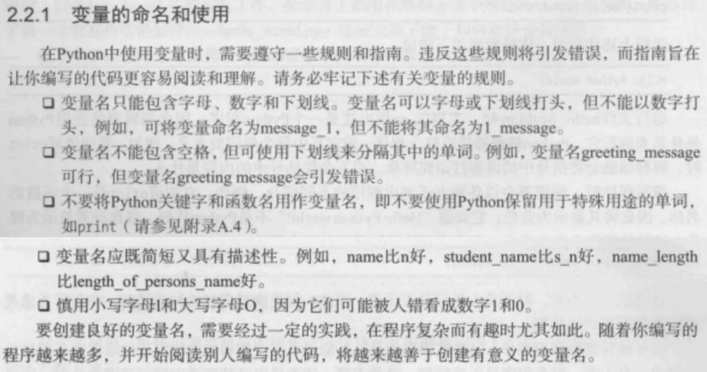

# Python 编程从入门到实践

## 2. 变量和简单数据类型

### 2.2 变量



- 避免使用大写字母

### 2.3 字符串

#### 转换大小写

- s.title()

```python
s = "LIKE"
print(s.title()) #以首字母大写的方式显示每个单词→Like 
```

- s.upper()

```python
s = "LIKE"
print(s.upper()) #以字母大写的方式显示每个单词→LIKE 
```

- s.lower()

```python
s = "LIKE"
print(s.upper()) #以字母小写的方式显示每个单词→like 
```

#### 拼接

```python
first_name = "talyor"
last_name = "swift"
full_name = first_name+" "+last_name
message = "Hello, this is " + full_name.title() + "!"
print(message) 
# Hello, this is Talyor Swift!
```

#### 制表符

```python
print("Languages:\n\tPython\n\tC++\n\tJava")
#Languages:
#	Python
#	C++
#	Java
```

#### 删除空白

```python
favorite_language = ' python '
print(favorite_language.rstrip()+" 1")
print(favorite_language.lstrip()+" 1")
print(favorite_language.strip()+" 1")
# python 1
#python  1
#python 1
```

### 2.4 数字

#### 整数

- \+  、- 、 * 、 /  、 **

```python
2 + 3 # 5
3 - 2 # 1
2 * 3 # 6
3 / 2 # 1.5			   python2中得到1，只包含整数部分
1 / 3 # 0.33333333333   python2中要想得到正确结果，得至少有个浮点数
3 ** 2 # 9
2 ** 9 # 512
(2+3)*4 # 20
```

#### 浮点数

- 从很大程度上说,使用浮点数时都无需考虑其行为。你只需输入要使用的数字, Python通常都会按你期望的方式处理它们

```python
0.1 + 0.1 # 0.2
2 * 0.2 # 0.4
//结果包含的小数位数可能是不确定的
print(0.2+0.1)	#0.30000000000000004
print(3*0.1)	#0.30000000000000004
```

#### str()

```python
age = 24
message = "Happy "+age+"th Birthday!"
print(message)
# Traceback (most recent call last):
#  File "D:/Python_Projects/Chapter 2.py", line 31, in <module>
#    message = "Happy "+age+"rd Birthday!"
# TypeError: can only concatenate str (not "int") to str

age = 24
message = "Happy "+str(age)+"th Birthday!"
print(message)
# Happy 24th Birthday!
```

### 2.5 python之禅

```python
import this
```

```python
The Zen of Python, by Tim Peters
# 你可以将余生都用来学习Python和编程的纷繁难懂之处,但这样你什么项目都完不成。不要企图编写完美无缺的代码;先编写行之有效的代码,再决定是对其做进一步改进,还是转而去编写新代码
Beautiful is better than ugly.
# 优美胜于丑陋（Python 以编写优美的代码为目标）。Python程序员笃信代码可以编写得漂亮而优雅。编程是要解决问题的,设计良好、高效而漂亮的解决方案都会让程序员心生敬意。随着你对Python的认识越来越深人,并使用它来编写越来越多的代码,有一天也许会有人站在你后面惊呼: “哇,代码编写得真是漂亮!"
Explicit is better than implicit.
# 明了胜于晦涩（优美的代码应当是明了的，命名规范，风格相似）
Simple is better than complex.
# 简洁胜于复杂（优美的代码应当是简洁的，不要有复杂的内部实现）。如果有两个解决方案,一个简单,一个复杂,但都行之有效,就选择简单的解决方案吧。这样,你编写的代码将更容易维护,你或他人以后改进这些代码时也会更容易。
Complex is better than complicated.
# 复杂胜于凌乱（如果复杂不可避免，那代码间也不能有难懂的关系，要保持接口简洁）。现实是复杂的,有时候可能没有简单的解决方案。在这种情况下,就选择最简单可行的解决方案吧。
Flat is better than nested.
# 扁平胜于嵌套（优美的代码应当是扁平的，不能有太多的嵌套）
Sparse is better than dense.
# 间隔胜于紧凑（优美的代码有适当的间隔，不要奢望一行代码解决问题）
Readability counts.
# 即便是复杂的代码,也要让它易于理解。开发的项目涉及复杂代码时,一定要为这些代码编,写有益的注释。
Special cases aren't special enough to break the rules.
Although practicality beats purity.
# 即便假借特例的实用性之名，也不可违背这些规则（这些规则至高无上）
Errors should never pass silently.
Unless explicitly silenced.
# 不要包容所有错误，除非你确定需要这样做（精准地捕获异常，不写 except:pass 风格的代码）
In the face of ambiguity, refuse the temptation to guess.
# 当存在多种可能，不要尝试去猜测
There should be one-- and preferably only one --obvious way to do it.
# 而是尽量找一种，最好是唯一一种明显的解决方案（如果不确定，就用穷举法）。如果让两名Python程序员去解决同一个问题,他们提供的解决方案应大致相同。这并不是说编程没有创意空间,而是恰恰相反!然而,大部分编程工作都是使用常见解决方案来解决简单的小问题,但这些小问题都包含在更庞大、更有创意空间的项目中。在你的程序中,各种具体细节对其他Python程序员来说都应易于理解。
Although that way may not be obvious at first unless you're Dutch.
# 虽然这并不容易，因为你不是 Python 之父（这里的 Dutch 是指 Guido ）
Now is better than never.
Although never is often better than *right* now.
# 做也许好过不做，但不假思索就动手还不如不做（动手之前要细思量）
If the implementation is hard to explain, it's a bad idea.
If the implementation is easy to explain, it may be a good idea.
#如果你无法向人描述你的方案，那肯定不是一个好方案；反之亦然（方案测评标准）
Namespaces are one honking great idea -- let's do more of those!
# 命名空间是一种绝妙的理念，我们应当多加利用（倡导与号召）
```

## 3. 列表

> 列表让你能够在一个地方存储成组的信息，其中可以只包含几个元素，也可以包含数百万个元素。列表是新手可直接使用的最强大的Python功能之一，它融合了众多重要的编程概念。

### 访问列表

```python
bicycles = ['trek','cannondale','redline','specialized']
print(bicycles) #全部列表
print(bicycles[0]) #第1个
print(bicycles[0].title())
print(bicycles[1]) #第2个
print(bicycles[3]) #第4个
print(bicycles[-1]) #最后一个
print(bicycles[-2]) #倒数第2个
# ['trek', 'cannondale', 'redline', 'specialized']
# trek
# Trek
# cannondale
# specialized
# specialized
# redline
```

```python
bicycles = ['trek','cannondale','redline','specialized']
message = "My first ficycle was a " +bicycles[0].title()+"."
print(message)
# My first ficycle was a Trek.
```

### 修改元素

```python
motorcycles = ['honda','yamaha','suzuki']
print(motorcycles)# ['honda', 'yamaha', 'suzuki']
 
motorcycles[0] = 'ducati'
print(motorcycles)# ['ducati', 'yamaha', 'suzuki']
```

### 添加元素

- 末尾添加：.append("XXX")

```python
motorcycles = ['honda','yamaha','suzuki']
print(motorcycles) # ['honda', 'yamaha', 'suzuki']

motorcycles.append("ducati")
print(motorcycles) # ['honda', 'yamaha', 'suzuki', 'ducati']
```

- 指定位置插入：.insert(k, "XXX")

```python
motorcycles = ['honda','yamaha','suzuki']
print(motorcycles) # ['honda', 'yamaha', 'suzuki']

motorcycles.insert(2,"ducati")
print(motorcycles) # ['honda', 'yamaha', 'ducati', 'suzuki']
```

### 删除元素

- 末尾删除：list.pop()
  - **append和pop就类似于栈的入栈和出栈操作。都在末尾进行**

```python
motorcycles = ['honda','yamaha','suzuki']
print(motorcycles) # ['honda', 'yamaha', 'suzuki']

poped_motorcycle = motorcycles.pop()
print(motorcycles)   # ['honda', 'yamaha']
print(poped_motorcycle) # suzuki
```

```python
last_owned = motorcycles.pop()
print("The last motorcycle I owned was a "+last_owned.title()+".")
# The last motorcycle I owned was a Suzuki.
```

- 指定位置删除：del list[k]

```python
motorcycles = ['honda','yamaha','suzuki']
print(motorcycles) # ['honda', 'yamaha', 'suzuki']

del motorcycles[2]
print(motorcycles) # ['honda', 'yamaha']
```

- 指定值删除：.remove("XXX")

```python
motorcycles = ['honda','yamaha','suzuki']
print(motorcycles) 
too_expensive = 'yamaha'
motorcycles.remove("yamaha")
print(motorcycles) 
print("\nA "+too_expensive.title()+" is too expensive for me.")
# ['honda', 'yamaha', 'suzuki']
# ['honda', 'suzuki']

# A Yamaha is too expensive for me.
```

### 组织列表

#### 排序

- 永久排序sort()

```python
cars = ['bmw','audi','toyota','subaru']
cars.sort()
print(cars)  # ['audi', 'bmw', 'subaru', 'toyota']

cars.sort(reverse=True)
print(cars)   # ['toyota', 'subaru', 'bmw', 'audi']
```

- 临时排序sorted()

```python
cars = ['bmw','audi','toyota','subaru']
print("Here is the original list:")
print(cars)

print("\nHere is the sorted list:")
print(sorted(cars))

print("\nHere is the original list again:")
print(cars)

# Here is the original list:
# ['bmw', 'audi', 'toyota', 'subaru']
# 
# Here is the sorted list:
# ['audi', 'bmw', 'subaru', 'toyota']
# 
# Here is the original list again:
# ['bmw', 'audi', 'toyota', 'subaru']
```

#### 翻转

- reverse()

```python
cars = ['bmw','audi','toyota','subaru']
cars.reverse()
print(cars) # ['subaru', 'toyota', 'audi', 'bmw']
```

#### 列表长度

> Python计算列表元素数时从1开始，因此确定列表长度时，你应该不会遇到差一错误。

- len()

```python
cars = ['bmw','audi','toyota','subaru']
print(len(cars))  # 4
```

#### 索引错误

```python
cars = ['bmw','audi','toyota','subaru']
print(cars[4])

# Traceback (most recent call last):
#   File "D:/Python_Projects/Chapter 3.py", line 62, in <module> print(cars[4])
# IndexError: list index out of range
```

## 4. 操作列表

### 统计计算

```python
digits = [1,2,3,4,5,6,7,8,9,0]
print(min(digits)) # 0
print(max(digits)) # 9
print(sum(digits)) # 45
```

### for循环输出


```python
magicians = ['alice', 'david', 'carolina']
for magician in magicians:  #从列表magicians中的名字中取出一个，将其存储在变量magician中
    print(magician)
# alice
# david
# carolina
```

- 编写for循环时，对于用于存储列表中每个值的临时变量，可指定任何名称。尽量选择有意义的名称。

```Python
for cat in cats:
for dog in dogs:
for item in list of items:
```

### for循环（more）

```python
magicians = ['alice', 'david', 'carolina']
for magician in magicians: 
    print(magician.title()+",that was a great trick!")
    print("I can't wait to see your next trick, "+magician.title()+".\n")
    
Alice,that was a great trick!
# I can't wait to see your next trick, Alice.
# 
# David,that was a great trick!
# I can't wait to see your next trick, David.
# 
# Carolina,that was a great trick!
# I can't wait to see your next trick, Carolina.
```

### 创建数值列表

#### 使用函数range()

- range(a,b) 从指定的a开始，在到达指定的第二个值后停止
  - —— [a，b）
- 使用range()时， 如果输出不符合预期，请尝试将指定的值加1或减1。

```python
for value in range(1,6):
    print(value)
# 1
# 2
# 3
# 4
# 5
```

- 用list()函数输出一个列表

```python
numbers = list(range(1,6))
print(numbers)
# [1, 2, 3, 4, 5]
```

- 间隔：range()函数的第三个参数

```python
even_numbers = list(range(2,11,2))
print(even_numbers)
# [2, 4, 6, 8, 10]
```

- range()几乎能够==创建任何需要的数字集==

```python
squares = []
for value in range(1,11):
    # square = value**2
    # squares.append((square))
    squares.append(value**2)
print(squares)

# [1, 4, 9, 16, 25, 36, 49, 64, 81, 100]
```


### 列表解析

- 前面介绍的生成列表squares的方式包含三四行代码，而列表解析让你只需编写一行代码就
  能生成这样的列表。列表解析将for循环和创建新元素的代码合并成一行， 并自动附加新元素。
  面向初学者的书籍并非都会介绍列表解析，这里之所以介绍列表解析，是因为等你开始阅读他人
  编写的代码时，很可能会遇到它们。

```python
# 功能同上
squares = [value**2 for value in range(1,11)]
print(squares)
```

- ==要能够生成属于自己的列表解析风格==needs practice

### 使用列表的一部分

#### 切片

```python
players = ['charles','martina','michael','florence','eli']
print(players[1:3])  # ['martina', 'michael']
#同range()也是【左闭右开】区间

players = ['charles','martina','michael','florence','eli']
print(players[0:3]) # ['charles','martina', 'michael']

#没有指定起始索引，Python从列表开头开始提取
print(players[:3])  # ['charles','martina', 'michael']

#没有指定结束索引，Python列表提取至末尾元素
print(players[2:])  # ['michael','florence','eli']

#负索引返回离列表末尾相应距离的元素，因此可以输出列表末尾的任何切片
#打印最后三个，即使列表长度变化也是如此
print(players[-3:]) # ['michael','florence','eli']
```

#### 遍历切片

```python
players = ['charles','martina','michael','florence','eli']
print("Here are the first three players on my team:")
for player in players[:3]:
    print(player.title())
# Here are the first three players on my team:
# Charles
# Martina
# Michael
```

#### 用切片复制列表

```python
my_foods = ['pizze','falafel','carrot cake']
friend_foods = my_foods[:]

my_foods.append('ice cream')
friend_foods.append('cannoli')

print("My favorite foods are:")
print(my_foods)
print("\nMy friends's favorite are:")
print(friend_foods)

# My favorite foods are:
# ['pizze', 'falafel', 'carrot cake', 'ice cream']
#
# My friends's favorite are:
# ['pizze', 'falafel', 'carrot cake', 'cannoli']
```

### 元组

- 对不应变化的值提供了一定程度的保护

> 列表非常适合用于存储在**程序运行期间可能变化的数据集**。列表是可以修改的，这对处理网站的用户列表或游戏中的角色列表至关重要。然而，有时候你需要创建一系列不可修改的元素，元组可以满足这种需求。Python将不能修改的值称为不可变的，而**不可变的列表**被称为元组。

#### 定义元组

```python
dimesions = (200,50)
print(dimesions[0]) # 200
print(dimesions[1]) # 50

# 元组是不可改变的，无法被赋值
dimesions[0] = 250
# Traceback (most recent call last):
#   File "D:/Python_Projects/Chapter 4.py", line 63, in <module>
#     dimesions[0] = 250
# TypeError: 'tuple' object does not support item assignment
```

#### 遍历元组

```python
dimesions = (200,50,30,10)
for dimesion in dimesions:
    print(dimesion)
# 200
# 50
# 30
# 10
```

#### 修改元组

- 虽然不能修改元组的元素，但可以给存储元组的变量赋值。因此，如果要修改前述矩形的尺寸，可重新定义整个元组:

```python
dimesions = (200,50,30,10)
print("Origianl dimesions:")
for dimesion in dimesions:
    print(dimesion)
    
dimesions = (400,100)
print("\nModified dimesions:")
for dimesion in dimesions:
    print(dimesion)

# Origianl dimesions:
# 200
# 50
# 30
# 10
# 
# Modified dimesions:
# 400
# 100
```

- 相比于列表，元组是更简单的数据结构。如果需要存储的一组值在程序的整个生命周期内都不变，可使用元组。


## 5. if语句

```python
cars = ['audi','bmw','subaru','toyota']

for car in cars:
    if car == 'bwm':
        print(car.uppper())
    else:
        print(car.title())
# Audi
# Bmw
# Subaru
# Toyota
```

### 条件测试

#### “不区分大小写”

```python
>>> car = 'Audi'
>>> car.lower() == 'audi'
True
>>> car
'Audi'
```

网站采用类似的方式让用户输入的数据符合特定的格式。例如，网站可能使用类似的测试来确保用户名是独一无二的，而并非只是与另一个用户名的大小写不同。用户提交新的用户名时，将把它转换为小写，并与所有既有用户名的小写版本进行比较。执行这种检查时，如果已经有用户名'john' (不管大小写如何)，则用户提交用户名'John'时将遭到拒绝。

#### 检查是否不相等

```python
requested_topping = 'mushrooms'
if requested_topping != 'anchovies':
    print("Hold the anchovies!")
# Hold the anchovies!
```

#### and = &&

#### or = ||

```python
age_0 = 22
age_1 = 18
age_0 >= 21 or age_1>=21 # True
age_0 >= 21 and age_1 >=21 # False
```

#### in  、not in

```python
locations = ['上海','南京','苏州']
if '北京' in locations:
    print("去过北京了")
else:
    print("下次去北京")
# 下次去北京
```

```python
banned_users = ['andrew','carolina','david']
user = 'marie'
if user not in banned_users:
    print(user.title()+", you can post a response if you wish")
# Marie, you can post a response if you wish
```

### if-elif-else"else是一条包罗万象的语句"

- else是一条包罗万象的语句，只要不满足任何if或elif中的条件测试，其中的代码就会执行，这**可能会引入无效甚至恶意的数据**。如果知道最终要测试的条件，应考虑使用一个elif代码块来代替else代码块。这样，你就可以肯定，仅当满足相应的条件时，你的代码才会执行。
- ——如果确定条件的所有范围，直接明确会比包含某些特殊情况要好

```python
age = 12
if age < 4:
    price = 0
elif age <18:
    price = 5
elif age <65:
    price = 10
elif age >=65:
    price = 5
print("Your admission cost is $"+str(price)+".")
```

### 使用if语句处理列表

#### 检查特殊元素

```python
requested_toppings = ['mushrooms', 'green peppers', ' extra cheese' ]
for requested_topping in requested_toppings:
    if requested_topping == 'green peppers':
        print("Sorry, we are out of green peppers right now.")
    else:
        print("Adding "+ requested_topping +".")
print("\nFinished making your pizza!")
# Adding mushrooms.
# Sorry, we are out of green peppers right now.
# Adding  extra cheese.
# 
# Finished making your pizza!
```

```python
requested_toppings = []
if requested_toppings:
    for requested_topping in requested_toppings:
        print("Adding "+ requested_topping +".")
    print("\nFinshed making your pizza!")
else:
    print("Are you sure you want a plain pizza?")
# Are you sure you want a plain pizza?
```

#### 使用多个列表

```python
available_toppings = ['mushrooms', 'olives', 'green peppers',
                      'pepperoni', 'pineapple', 'extra cheese']
requested_toppings = ['mushrooms', 'french fries', 'extra cheese']
for requested_topping in requested_toppings:
    if requested_topping in available_toppings:
        print("Adding " + requested_topping + ".")
    else:
        print("Sorry, we don't have " + requested_topping + ".")
print("\nFinished making your pizza!")
# Adding mushrooms.
# Sorry, we don't have french fries.
# Adding extra cheese.
# 
# Finished making your pizza!
```

## 6. 字典

> 在Python中，字典是一系列**键-值对**。每个键都与一个值相关联，你可以使用键来访问与之相关联的值。与键相关联的值可以是数字、字符串、列表乃至字典。事实上，可将任何Python对象用作字典中的值。
>
> 键值对是两个相关联的值。指定键时，Python将返回与之相关联的值。键和值之间用冒号分隔，而键值对之间用逗号分隔。在字典中，你想存储多少个键值对都可以。

```python
alien_0 = {'color':'green','points':5}
```

### 使用字典

#### 访问字典

```python
alien_0 = {'color': 'green', 'points': 5}
new_points = alien_0['points']
print("You just earned "+str(new_points)+" points!")
# You just earned 5 points!
```

- 如果你在有外星人被射杀时都运行这段代码，就会获取该外星人的点数。

#### 添加键值对

```python
alien_0 = {'color': 'green', 'points': 5}
alien_0['x_position'] = 0
alien_0['y_position'] = 25
print(alien_0)
# {'color': 'green', 'points': 5, 'x_position': 0, 'y_position': 25}
```

```python
alien_0 = {}
alien_0['color'] = 'green'
alien_0['points'] = 5
```

#### 修改字典中的值

```python
alien_0 = {'color': 'green'}
print("The alien is "+alien_0['color']+".")
alien_0['color'] = 'yellow'
print("The alien is now "+alien_0['color']+".")
# The alien is green.
# The alien is now yellow.
```

```python
alien_0 = {'x_position': 0, 'y_position': 25, 'speed': 'fast'}
print("Original x-position: " + str(alien_0['x_position']))

# 向右移动外星人
# 据外星人当前速度决定将其移动多远
if alien_0['speed'] == 'slow':
    x_increment = 1
elif alien_0['speed'] == 'medium':
    x_increment = 2
else:
    # 这个外星人的速度一定很快
    x_increment = 3
    # 或者直接改变外星人的行为
    alien_0['speed'] = 'very fast'

alien_0['x_position'] = alien_0['x_position'] + x_increment
print("New x-position: " + str(alien_0['x_position']))
print("The alien's speed state is: "+ alien_0['speed'])
# Original x-position: 0
# New x-position: 3
# The alien's speed state is: very fast
```

#### 由类似对象组成的字典

```python
favorite_languages = {
    'jen': 'python',
    'sarah': 'c',
    'edward': 'ruby',
    'phil': 'c++'
}
print("Sarah's favorite language is "+
      favorite_languages['sarah'].title()+".")
# Sarah's favorite language is C.
```

### 遍历字典

#### 遍历所有键值对

```python
user_0 = {
    'username': 'efermi',
    'first': 'enrico',
    'last': 'fermi'
}
for key, value in user_0.items():
    print("Key: " + key)
    print("Value: " + value+"\n")

# Key: username
# Value: efermi
# 
# Key: first
# Value: enrico
# 
# Key: last
# Value: fermi
```

注意，即便遍历字典时，键值对的返回顺序也与存储顺序不同。Python不关心键 值对的存储顺序，而只跟踪键和值之间的关联关系。

#### 遍历字典中的所有键

```python
favorite_languages = {
    'jen': 'python',
    'sarah': 'c',
    'edward': 'ruby',
    'phil': 'c++'
}
for name in favorite_languages.keys():
    print(name.title())
# Jen
# Sarah
# Edward
# Phil
```

```python
favorite_languages = {
    'jen': 'python',
    'sarah': 'c',
    'edward': 'ruby',
    'phil': 'c++'
}
friends = ['phil', 'sarah']
for name in favorite_languages.keys():
    print(name.title())
    if name in friends:
        print("   Hi " + name.title() +
              ", I see your favorite language is " +
              favorite_languages[name].title() + "!")
if 'erin' not in favorite_languages.keys():
    print("Erin, please take our poll !")
# Jen
# Sarah
#    Hi Sarah, I see your favorite language is C!
# Edward
# Phil
#    Hi Phil, I see your favorite language is C++!
# Erin, please take our poll !
```

- ​	遍历字典时，会默认遍历所有的键，因此，如果将上述代码中的for name in favorite_languages.keys(): 替换为 for name in favorite languages:，输出将不变。
  ​	如果显式地使用方法keys()可让代码更容易理解，你可以选择这样做，但如果你愿意，也可省略它。

#### 【按顺序】遍历字典中的所有键

- 字典总是明确地记录键和值之间的关联关系，但获取字典的元素时，获取顺序是不可预测的。这不是问题，因为通常你想要的只是获取与键相关联的正确的值。要以特定的顺序返回元素，一种办法是在for循环中对返回的键进行排序。为此，可使用函数sorted()来获得按特定顺序排列的键列表的副本:

```python
favorite_languages = {
    'jen': 'python',
    'sarah': 'c',
    'edward': 'ruby',
    'phil': 'c++'
}
for name in sorted(favorite_languages.keys()):
    print(name.title()+ "，thank you for taking the poll.")
# Edward，thank you for taking the poll.
# Jen，thank you for taking the poll.
# Phil，thank you for taking the poll.
# Sarah，thank you for taking the poll.
```

#### 遍历字典中的所有值

```python
favorite_languages = {
    'jen': 'python',
    'sarah': 'c',
    'edward': 'ruby',
    'phil': 'c++'
}
print("The following languages have been mentioned:")
for language in favorite_languages.values():
    print('\t'+language.title())
# The following languages have been mentioned:
# 	Python
# 	C
# 	Ruby
# 	C++
```

- 这种做法提取字典中所有的值，而没有考虑是否重复。涉及的值很少时，这也许不是问题，但如果被调查者很多，最终的列表可能包含大量的重复项。为剔除重复项，可使用集合( set)。集合类似于列表，但每个元素都必须是独一无二的:

```python
favorite_languages = {
    'jen': 'python',
    'sarah': 'c++',
    'edward': 'ruby',
    'phil': 'c++'
}
print("The following languages have been mentioned:")
for language in set(favorite_languages.values()):
    print('\t'+language.title())
# The following languages have been mentioned:
# 	Python
# 	C++
# 	Ruby
```

### 嵌套

#### 字典列表

```python
alien_0 = {'color':'green','point':5}
alien_1 = {'color':'yellow','point':10}
alien_2 = {'color':'red','point':15}
aliens = [alien_0,alien_1,alien_2]
for alien in aliens:
    print(alien)
# {'color': 'green', 'point': 5}
# {'color': 'yellow', 'point': 10}
# {'color': 'red', 'point': 15}
```

```python
aliens = []
score = 1
for alien_number in range(30):
    if score % 3 != 0:
        new_alien = {'color':'green','points': score,'speed':'slow'}
    else:
        new_alien = {'color': 'yellow', 'points': score, 'speed': 'slow'}
    aliens.append(new_alien)
    score = score + 1

for alien in aliens[0:9]:
    if alien['color'] == 'green':
        alien['color'] = 'yellow'
        alien['speed'] = 'medium'
        alien['points'] = 10
    elif alien['color'] =='yellow':
        alien['color'] = 'red'
        alien['speed'] = 'fast'
        alien['points'] = 15
#显示前5个外星人
for alien in aliens[:9]:
    print(alien)
print("...")
#显示创建了多少个外星人
print("Total number of aliens: "+str(len(aliens)))

# {'color': 'yellow', 'points': 10, 'speed': 'medium'}
# {'color': 'yellow', 'points': 10, 'speed': 'medium'}
# {'color': 'red', 'points': 15, 'speed': 'fast'}
# {'color': 'yellow', 'points': 10, 'speed': 'medium'}
# {'color': 'yellow', 'points': 10, 'speed': 'medium'}
# {'color': 'red', 'points': 15, 'speed': 'fast'}
# {'color': 'yellow', 'points': 10, 'speed': 'medium'}
# {'color': 'yellow', 'points': 10, 'speed': 'medium'}
# {'color': 'red', 'points': 15, 'speed': 'fast'}
# ...
# Total number of aliens: 30
```

### 在字典中存储列表

- 每当需要在字典中将一个键关联到多个值时，都可以在字典汇中嵌套一个列表。

```python
pizza = {
    'crust': 'thick',
    'toppings': ['mushrooms', 'extra cheese'], # 在字典中存储列表
}

print("You ordered a "+ pizza['crust'] +"-crust pizza"+ "with the following toppings:")

for topping in pizza['toppings']:
    print("\t" + topping)

# You ordered a thick-crust pizzawith the following toppings:
# 	mushrooms
# 	extra cheese
```

```python
favorite_languages = {
    'jen': ['python','ruby'],
    'sarah':['c'],
    'edward': ['ruby','go'],
    'phil':['python','haskell'],
}
for name, languages in favorite_languages.items():
# 这里name自动对应键，languages自动对应值
    print("\n"+name.title()+"'s favorite languages are: ")
    for language in languages:
        print("\t"+language.title())
# Jen's favorite languages are: 
# 	Python
# 	Ruby
# 
# Sarah's favorite languages are: 
# 	C
# 
# Edward's favorite languages are: 
# 	Ruby
# 	Go
# 
# Phil's favorite languages are: 
# 	Python
# 	Haskell
```

#### 在字典中存储字典

```PYTHON
users = {
    'aeinstein':{
        'first':'albert',
        'last':'einstein',
        'location':'princeton',
    },
    'mcurie':{
        'first': 'marie',
        'last': 'curie',
        'location': 'paris',
    },
}
for username, user_info in users.items():
    print("\nUsername: "+ username)
    full_name = user_info['first']+" " +user_info['last']
    location = user_info['location']
    print("\tFull name: "+full_name.title())
    print("\tLocation: "+location.title())
# Username: aeinstein
# 	Full name: Albert Einstein
# 	Location: Princeton
# 
# Username: mcurie
# 	Full name: Marie Curie
# 	Location: Paris
```

## 7. 用户输入和while循环

### 函数input()的工作原理

- 函数input()接受一个参数：即**要向用户显示的提示或说明，让用户知道该如何做**。在这个
  示例中，Python运行第1行代码时，用户将看到提示Tell me something, and I will repeat it back to you: 程序等待用户输人，并在用户按回车键后继续运行。输人存储在变量message中，接下来的print(message)将输人呈现给用户:

```python
message = input("Tell me something, and I will repeat it back to you: ")
print(message)
# Tell me something, and I will repeat it back to you: Hello World!
# Hello World!
```

```python
prompt  = "If you tell us who you are, we can personalize the messages you see."
prompt += "\nWhat is your first name? "
name = input(prompt)
print("\nHello, "+name+"!")

# If you tell us who you are, we can personalize the messages you see.
# What is your first name? Like
# 
# Hello, Like !
```

### 使用int()来获取数值输入

```python
height = input("How tall are you, in meters? ")
height = float(height)  # input函数直接输入得到的是字符串，做比较时得转换成数值
print(height)
if height >= 1.2:
    print("\nYou're tall enough to ride!" )
else:
    print("\nYou'll be able to ride when yor're a little older")
```

### 求模

```python
number = input("Enter a number, and I'll tell you if it's even or odd: ")
number = int(number)  # input函数直接输入得到的是字符串，做数值计算时得转换成数值

if number % 2 == 0:
    print("\nThe number " + str(number) + " is even.")
else:
    print("\nThe number " + str(number) + " is odd.")
# Enter a number, and I'll tell you if it's even or odd: 52
# 
# The number 52 is even.
```

### 使用while循环

```python
current_number = 1
while current_number <= 5:
    print(current_number)
    current_number += 1
# 1
# 2
# 3
# 4
# 5
```

#### 让用户选择何时退出

```python
prompt = "\nTell me something, and I will repeat it back to you: "
prompt += "\nEnter 'quit' to end the program."
message = ""
while message != 'quit':
    message = input(prompt)
    if message != 'quit':
        print(message)
______________________________或者______________________________
prompt = "\nTell me something, and I will repeat it back to you: "
prompt += "\nEnter 'quit' to end the program."
active = True
while active:
    message = input(prompt) # 将要打印的字符放到变量中，这样可以使逻辑更清晰
    if message == 'quit':
        active = False
    else:
        print(message)
# Tell me something, and I will repeat it back to you:
# Enter 'quit' to end the program.hello
# hello
#
# Tell me something, and I will repeat it back to you:
# Enter 'quit' to end the program.???
# ???
#
# Tell me something, and I will repeat it back to you:
# Enter 'quit' to end the program.quit
#
# Process finished with exit code 0
```

#### 使用break退出循环

```python
prompt = "\nPlease enter the name of a city you have visited: "
prompt += "\n(Enter 'quit' when you are finished.)"
while True:
    city = input(prompt)
    if city == 'quit':
        break
    else:
        print("I'd love to go to " + city.title() +"!")
# Please enter the name of a city you have visited: 
# (Enter 'quit' when you are finished.)new york
# I'd love to go to New York!
# 
# Please enter the name of a city you have visited: 
# (Enter 'quit' when you are finished.)san francisco
# I'd love to go to San Francisco!
# 
# Please enter the name of a city you have visited: 
# (Enter 'quit' when you are finished.)quit
# 
# Process finished with exit code 0
```

#### 在循环中使用continue

```python
current_number = 0
while current_number < 10:
    current_number += 1
    if current_number % 2 == 0:
        continue
    print(current_number)
# 1
# 3
# 5
# 7
# 9
```

### 使用while循环来处理列表和字典

#### 在列表之间移动元素

```python
# 首先，创建一个待验证用户列表
# 和一个用于存储已验证用户的空列表
unconfirmed_users = ['alice', 'brian', 'candace']
confirmed_users = []
# 验证每个用户，直到没有未验证用户为止
# 将每个经过验证的列表都移到已验证用户列表中
while unconfirmed_users:
    current_user = unconfirmed_users.pop()
    print("Verifying user: " + current_user.title())
    confirmed_users.append(current_user)
# 显示所有已验证用户
print("\nThe following users have been confirmed: ")
for confirmed_user in confirmed_users:
    print(confirmed_user.title())
# Verifying user: Candace
# Verifying user: Brian
# Verifying user: Alice
# 
# The following users have been confirmed: 
# Candace
# Brian
# Alice
```

#### 删除包含特定值的所有列表元素

- 在第3章中，我们使用函数remove()来删除列表中的特定值，这之所以可行，是因为要删除的值在列表中只出现了一次。如果要删除列表中所有包含特定值的元素，该怎么办呢?

```python
pets = ['dog','cat','dog','goldfish','cat','rabbit','cat']
print(pets)
while 'cat' in pets:
    pets.remove('cat')
print(pets)
# ['dog', 'cat', 'dog', 'goldfish', 'cat', 'rabbit', 'cat']
# ['dog', 'dog', 'goldfish', 'rabbit']
```

#### 使用用户输入来填充字典

```python
responses = {}
# 设置一个标志，指出调查是否继续
polling_active = True
while polling_active:
    # 提示输入被调查者的名字和回答
    name = input("\nWhat is your name?")
    response = input("which mountain would you like to climb someday? ")
    # 将答卷存储在字典中
    responses[name] = response
    # 看看是否还有人要参与调查
    repeat = input("Would you like to let another person respond? (yes/ no) ")
    if repeat == 'no':
        polling_active = False
# 调查结束，显示结果.
print("\n--- Poll Results ---")
for name, response in responses.items():
    print(name + " would like to climb " + response + ".")
# What is your name?like
# which mountain would you like to climb someday? ximalaya
# Would you like to let another person respond? (yes/ no) yes
# 
# What is your name?wang
# which mountain would you like to climb someday? qinling
# Would you like to let another person respond? (yes/ no) no
# 
# --- Poll Results ---
# like would like to climb ximalaya.
# wang would like to climb qinling.
```

## 8. 函数

```python
def greet_user(username):
    "显示简单的问候语"
    print("Hello, "+ username.title() +"!")

greet_user('jesse')
# Hello, Jesse!
```

### 传递实参

#### 位置实参

- 注意多个参数时，实参的前后位置要对应准确

```python
def describe_pet(animal_type, pet_name):
    "显示宠物的信息"
    print("\nI have a "+animal_type+".")
    print("My "+animal_type+"'s name is "+pet_name.title()+".")

describe_pet('hamster', 'harry')
describe_pet('dog', 'willie')
# I have a hamster.
# My hamster's name is Harry.
# 
# I have a dog.
# My dog's name is Willie.
```

#### 关键字实参

- 关键字实参是传递给函数的名称值对。你直接在实参中将名称和值关联起来了，因此向函数传递实参时不会混淆(不会得到名为Hamster的harry这样的结果)。关键字实参让你无需考虑函数调用中的实参顺序，还清楚地指出了函数调用中各个值的用途。
- 使用关键字实参时，务必准确地指定函数定义中的形参名。

```python
def describe_pet(animal_type, pet_name):
    "显示宠物的信息"
    print("\nI have a "+animal_type+".")
    print("My "+animal_type+"'s name is "+pet_name.title()+".")

describe_pet('hamster', 'harry')
describe_pet(pet_name='harry',animal_type='hamster')
# I have a hamster. 
# My hamster's name is Harry.
#
# I have a hamster.
# My hamster's name is Harry.
```

#### 默认值

- 使用默认值时，在形参列表中必须先列出没有默认值的形参，再列出有默认值的实参。这让Python依然能够正确地解读位置实参。

```python
def describe_pet(pet_name, animal_type='dog'):
    """显示宠物的信息"""
    print("\nI have a " + animal_type + ".")
    print("My " + animal_type + "'s name is " + pet_name.title() + ".")


describe_pet(pet_name='willie')
describe_pet('willie') # 这样也行，因此pet_name得放在第一个位置
# I have a dog.
# My dog's name is Willie.
```

#### 等效的函数调用

```Python
# 函数定义
def describe_pet(pet_name, animal_type= 'dog' ):


# 函数调用    
#一条名为Willie的小狗
describe_pet('willie')
describe_pet(pet_name= 'willie')
#一只名为Harry的仓鼠
describe_pet('harry','hamster' )
describe_pet(pet_name=' harry', animal_type= 'hamster')
describe_pet(animal_type=' hamster', pet_name= ' harry')
```

### 返回值

```python
def get_formatted_name(first_name, last_name):
    """返回整洁的姓名"""
    full_name = first_name + ' ' + last_name
    return full_name.title()

musician = get_formatted_name('jimi', 'hendrix')
print(musician)
# Jimi Hendrix
```

```python
def get_formatted_name(first_name, last_name, middle_name=''):	# 注意参数位置
    """返回整洁的姓名"""
    if middle_name:
        full_name = first_name + ' ' + middle_name + ' ' + last_name
    else:
        full_name = first_name + ' ' + last_name
    return full_name.title()

musician = get_formatted_name('jimi', 'hendrix')
print(musician)
musician = get_formatted_name('john', 'hooker ', 'lee')
print(musician) 
# Jimi Hendrix 
# John Lee Hooker 
```

#### 返回字典

```python
def build_person(first_name, last_name):
    """返回一个字典，其中包含有关一个人的信息"""
    person = {'first': first_name, 'last': last_name}
    return person

musician = build_person('jimi', 'hendrix')
print(musician)
# {'first': 'jimi', 'last': 'hendrix'}


# 加入可选形参，年龄
def build_person(first_name, last_name, age=''):
    """返回一个字典，其中包含有关一个人的信息"""
    person = {'first': first_name, 'last': last_name}
    if age:
        person['age'] = age
    return person

musician = build_person('jimi', 'hendrix', age = 24)
# musician = build_person('jimi', 'hendrix', 24)  # "age=" 可省略
print(musician)
# {'first': 'jimi', 'last': 'hendrix', 'age': 24}
```

#### 加入循环

```python
def get_formatted_name(first_name, last_name,age=''):
    """返回整洁的姓名"""
    full_name = first_name + ' '+last_name
    return full_name.title()

while True:
    print("\nPlease tell me your name:")
    print("(enter 'q' at any time to quit.)")
    f_name = input("First name:")
    if f_name == 'q':
        break
    l_name = input("Last name:")
    if l_name == 'q':
        break
    formatted_name = get_formatted_name(f_name,l_name)
    print("\nHello, " + formatted_name+"!")
    
# Please tell me your name:
# (enter 'q' at any time to quit.)
# First name:li
# Last name:ke
# 
# Hello, Li Ke!
# 
# Please tell me your name:
# (enter 'q' at any time to quit.)
# First name:wu
# Last name:suying
# 
# Hello, Wu Suying!
# 
# Please tell me your name:
# (enter 'q' at any time to quit.)
# First name:q 
```

### 传递列表

```python
def greet_users(names):
    """向列表中的每位用户都发出简单的问候"""
    for name in names:
        msg = "Hello, "+ name.title()+"!"
        print(msg)
usernames = ['hannah', 'ty','margot']
greet_users(usernames)
# Hello, Hannah!
# Hello, Ty!
# Hello, Margot!
```

#### 在函数中修改列表

```python
# 首先创建一个列表，其中包含一些要打印的设计
def print_models(unprinted_designs, completed_models):
    # 模拟打印每个设计，直到没有未打印的设计为止
    # 打印每个设计后，都将其移到列表completed_models中
    while unprinted_designs:
        current_design = unprinted_designs.pop()
        # 模拟根据设计制作3D打印模型的过程
        print("Printing model: " + current_design)
        completed_models.append(current_design)


def show_completed_models(completed_models):
    # 显示打印好的所有模型
    print("\nThe following models have been printed:")
    for completed_model in completed_models:
        print(completed_model)


unprinted_designs = ['iphone case', 'robot pendant', 'dodecahedron']
completed_models = []

print_models(unprinted_designs,completed_models)
show_completed_models(completed_models)
print(unprinted_designs)
# Printing model: dodecahedron
# Printing model: robot pendant
# Printing model: iphone case
#
# The following models have been printed:
# dodecahedron
# robot pendant
# iphone case
# []
```

#### 切片表示法

```python
function_name(list_name[:])
# 切片表示法[:]创建列表的副本
```

```python
# 上面的处理中，把unprinted_designs中的元素pop出去，就改变了列表
# 切片表示法[:]创建列表的副本，将列表的副本传递给函数。类似C语言里的引用，不会改变原来的列表
print_models(unprinted_designs[:],completed_models)
print(unprinted_designs)
# The following models have been printed:
# dodecahedron
# robot pendant
# iphone case
# ['iphone case', 'robot pendant', 'dodecahedron']
```

### 传递任意数量的实参

```python
def make_pizza(*toppings):
    """概述要制作的披萨(打印出每一份披萨的配料)"""
    print("\nMaking a pizza with the following toppings:")
    for topping in toppings:
        print("- "+ topping)

make_pizza('pepperoni')
make_pizza('mushrooms','green peppers','extra cheese')

# Making a pizza with the following toppings:
# - pepperoni
#
# Making a pizza with the following toppings:
# - mushrooms
# - green peppers
# - extra cheese
```

#### 结合使用位置实参和任意数量实参

```python
def make_pizza(size, *toppings):
    """概述要制作的披萨"""
    print("\nMaking a " + str(size) +
          "-inch pizza with the following toppings:")
    for topping in toppings:
        print("- " + topping)


make_pizza(16, 'pepperoni')
make_pizza(12, 'mushrooms', 'green peppers', 'extra cheese')
# Making a 16-inch pizza with the following toppings:
# - pepperoni
# 
# Making a 12-inch pizza with the following toppings:
# - mushrooms
# - green peppers
# - extra cheese
```

#### 使用任意数量的关键字实参

- 形参**user_info中的两个星号让Python创建一个名为user_info的空字典，并将收到的所有名称-值对都封装到这个字典中。在这个函数中，可以像访问其他字典那样访问user_info中的名称-值对。

```python
def build_profile(first, last, **user_info):
    """创建一个字典，其中包含我们知道的有关用户的一切"""
    profile = {}
    profile['first_name'] = first
    profile['last_name'] = last
    # 可简写成下面的写法
    # profile = {'first_name': first, 'last_name': last}
    for key, value in user_info.items():
        profile[key] = value
    # 我们遍历字典user_info中的键-值对，并将每个键值对都加入到字典profile中
    return profile

user_profile = build_profile('albert', 'einstein',
                             location='princeton',
                             field='physics')
print(user_profile)

# {'first_name': 'albert', 'last_name': 'einstein', 
# 'location': 'princeton', 'field': 'physics'}
```

> 编写函数时，你可以以各种方式**混合使用位置实参、关键字实参和任意数量的实参**。知道这些实参类型大有裨益，因为阅读别人编写的代码时经常会见到它们。**要正确地使用这些类型的实参并知道它们的使用时机**，需要经过一定的练习。就目前而言，牢记使用最简单的方法来完成任务就好了。继续往下阅读，就会知道在各种情况下哪种方法的效率是最高的。

### 将函数存储在模块中 — import

```python
# 导入整个模块
module_name.function_name()
# 导入模块中的特定函数
from module_name import function_name
```

```python
# 导入整个模块
import pizza
# 导入模块中的特定函数
from pizza import make_pizza
```

- Python读取这个文件时，代码行`import pizza`让Python打开文件pizza.py,并将其中的所有函数都复制到这个程序中。你看不到复制的代码，因为这个程序运行时，Python在 幕后复制这些代码。你只需知道，在making_pizzas.py中， 可以使用pizza.py中定义的所有函数。

#### 重命名 — as

```python
import function_name as fn
from module_name import function_name as fn

from pizza import make_pizza as mp
import make_pizza as mp
```

#### 导入所有 — *

```python
from module_name import *
#  = import module_name
```


## 9. 类

> 类将函数和数据整洁地封装起来，让你能够灵活而高效地使用它们。

### 创建和使用类

看书《Python编程从入门到实践》：==P157==


### 使用类和实例


### 继承


### 导入类


### Python标准库


### 类编码风格


